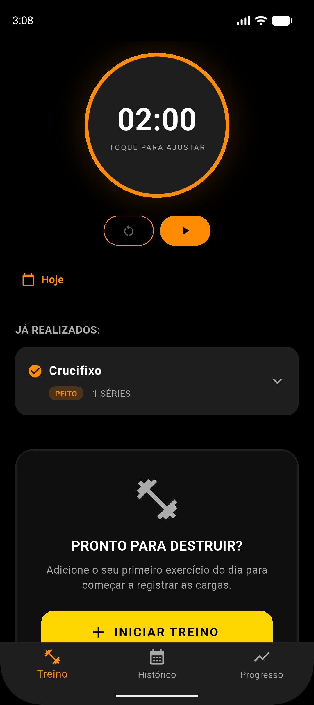
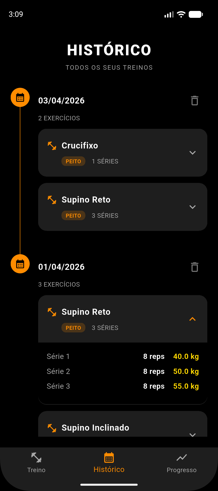
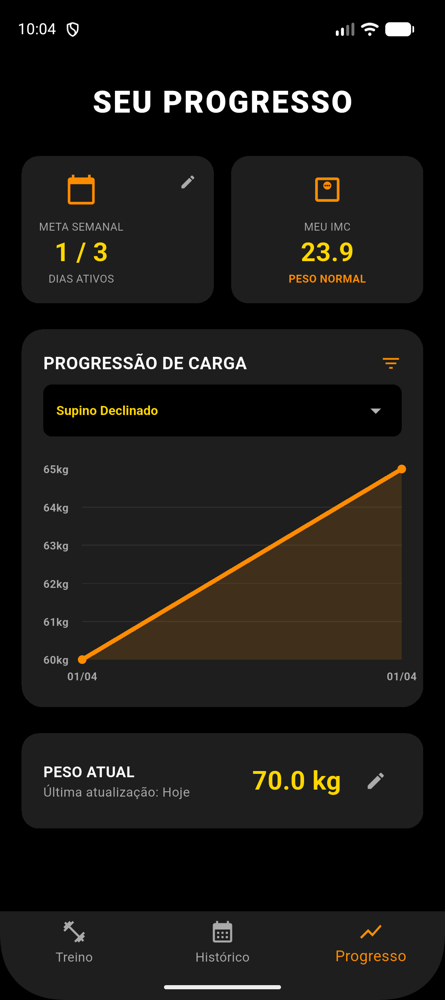

# Gym Saiyajin

Aplicativo mobile offline-first para rastreamento de treinos de musculação, construído com Flutter, SQLite e Clean Architecture. Focado em:

- Fluxo rápido de treino (exercícios, séries e cronômetro de descanso)
- Histórico persistido em SQLite localmente
- Dashboard de progresso com métricas e gráfico de progressão de carga

## Imagens da Aplicação

<p align="center">
  
  
  
</p>

## Visão Geral

O projeto foi refatorado para uma base mais limpa e escalável, com:

- Modelos tipados (sem uso de Map<String, dynamic> no domínio)
- Controllers com ChangeNotifier para regras de negócio
- Camada de repositório para persistência no SQLite
- Serviço dedicado para persistência de preferências (SharedPreferences)
- Widgets extraídos para UI mais declarativa e reutilizável

## Stack Tecnológico

- **Flutter (Dart)**
- **sqflite** (Banco de dados local relacional)
- **path** (Gerenciamento de diretórios do SO)
- **fl_chart** (Gráficos analíticos)
- **shared_preferences** (Persistência de configurações chave-valor)
- **vibration** (Feedback tátil nativo de hardware)

## Arquitetura Atual

Organização principal em camadas:

- `models/`: entidades de domínio
- `controllers/`: estado + regras de negócio
- `repositories/`: acesso a dados (SQLite)
- `database/`: configuração e schema do banco
- `services/`: serviços de infraestrutura (preferências e configurações)
- `widgets/`: componentes visuais reutilizáveis
- `screens/`: composição de telas

### Estrutura de Pastas

```text
gym_saiyajin/
|- lib/
|  |- controllers/
|  |  |- treino_controller.dart
|  |  |- historico_controller.dart
|  |  `- progresso_controller.dart
|  |- database/
|  |  `- db_helper.dart
|  |- models/
|  |  |- serie.dart
|  |  |- exercicio.dart
|  |  `- sessao_treino.dart
|  |- repositories/
|  |  `- treino_repository.dart
|  |- services/
|  |  `- preferences_service.dart
|  |- screens/
|  |  |- treino_screen.dart
|  |  |- historico_screen.dart
|  |  `- progresso_screen.dart
|  `- widgets/
|     |- cronometro_widget.dart
|     |- serie_row_widget.dart
|     |- selecao_exercicio_modal.dart
|     |- config_tempo_descanso_modal.dart
|     |- historico_card_widget.dart
|     |- metricas_dashboard_widget.dart
|     `- progresso_grafico_widget.dart
`- pubspec.yaml
```

## Persistência (SQLite)

Banco: `gym_saiyajin.db`

Tabelas relacionais:

- `sessoes`: `id`, `data`, `nome_treino`
- `exercicios`: `id`, `sessao_id`, `nome`, `grupo`
- `series`: `id`, `exercicio_id`, `peso`, `reps`, `concluida`

Repositório principal:

- `TreinoRepository`
- `salvarSessaoTreino(sessao)`: transacional, grava sessão -> exercícios -> séries
- `buscarHistoricoTreinos()`: reconstrói lista de sessões com dados aninhados

## Funcionalidades Implementadas

### Treino

- Seleção de exercício com busca por nome/grupo e criação de novo exercício via modal (seleção de grupo muscular).
- Registro de séries (peso/reps) e marcação de série concluída.
- Cronômetro global de descanso com iniciar, pausar, reiniciar, continuar. Anel de progresso visual que esvazia com o tempo e vibração nativa ao finalizar.
- Tempo de descanso padrão persistido com SharedPreferences (sobrevive entre sessões do app).
- Encerramento do treino com persistência transacional.

### Histórico

- Carregamento real do SQLite via TreinoRepository.
- Timeline de sessões com cards expansíveis por exercício com detalhamento de séries.

### Progresso

- Cálculo dinâmico de IMC e dias ativos na janela dos últimos 7 dias.
- Filtro dinâmico e inteligente (ignora bancos vazios).
- Gráfico interativo exibindo o Progressive Overload (peso máximo por sessão) ao longo do tempo.

## Injeção de Dependências

No ponto central da aplicação (TelaBase):

- Instância única de TreinoRepository injetada em TreinoController, HistoricoController e ProgressoController.
- Instância única de PreferencesService injetada em TreinoController e ProgressoController.

Com isso, treino, histórico e progresso compartilham a mesma fonte de dados simultaneamente.

## Navegação e Retenção de Estado

- A navegação por abas usa `IndexedStack` no `body` do `Scaffold` da `TelaBase`.
- Essa abordagem mantém as telas vivas ao alternar abas, evitando perda de estado visual e de controllers.

## Persistência de Preferências (SharedPreferences)

A classe `PreferencesService` centraliza:

- Chaves de configuração da aplicação (`keyTempoDescanso`, `keyPesoAtual`, etc.)
- Operações genéricas assíncronas: `salvarInt`, `lerInt`, `salvarDouble`, `lerDouble`, `salvarString`, `lerString`, `remover`

Os controllers não instanciam `SharedPreferences` diretamente; todo acesso é feito via serviço injetado, melhorando coesão e testabilidade.

## Como Rodar

Pré-requisitos:

- Flutter SDK instalado
- Android Studio/VS Code configurado

Comandos:

- Instalar dependências: `flutter pub get`
- Executar em debug: `flutter run`
- Gerar APK release: `flutter build apk`

## Troubleshooting

### Erro de permissão ao baixar pacotes no Windows (Symlinks)

Se ao rodar `flutter pub add shared_preferences` você receber a mensagem "Building with plugins requires symlink support":

1. Pressione `Windows + R`, digite `ms-settings:developers` e dê Enter.
2. Ative a opção Modo de Desenvolvedor.
3. Rode `flutter pub get` novamente no terminal do projeto.

## Licença

MIT

