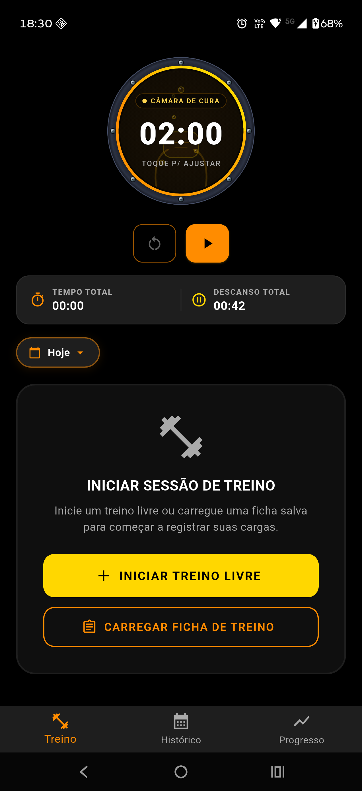
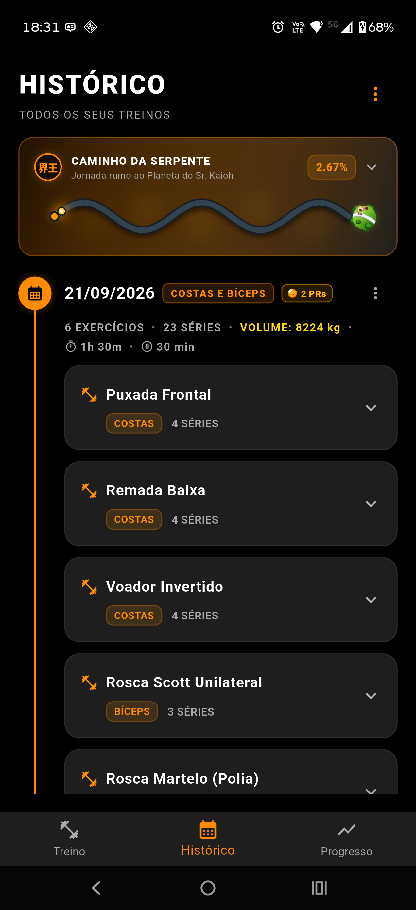
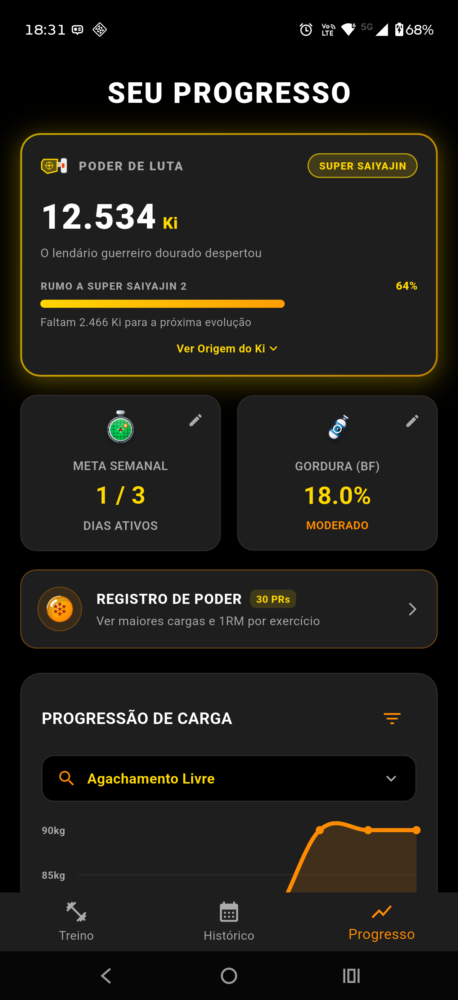

# 🐉 Gym Saiyajin

<p align="center">
  <strong>Aplicativo mobile offline-first para rastreamento de treinos de musculação, construído com Flutter, SQLite e arquitetura limpa com foco em ergonomia esportiva, robustez visual e temática Saiyajin.</strong>
</p>

<p align="center">
  
  
  
  
  
</p>

---

## 📸 Demonstração Visual

<p align="center">
  
  
  
</p>

---

## 📚 Documentação Especializada

Para manter o repositório organizado e detalhar com profundidade cada engenharia do projeto, a documentação está dividida nos seguintes guias modulares:

- 🏛️ **[Arquitetura & Engenharia de Software](docs/ARQUITETURA.md)**: Detalhamento das camadas do app (Controllers, Repositories, Services, Models), schema do banco de dados SQLite com integridade referencial, estratégias de migração de banco, tratamento de ciclo de vida do SO e matriz da suíte de testes.
- 🎨 **[Design System, Ergonomia & UI/UX](docs/UI_UX.md)**: Princípios de usabilidade sob fadiga física, design tokens, anatomia simétrica das séries, fluxo contínuo de teclado, micro-badges de PRs, proteção de layout (SafeArea/insets) e arte vetorial nativa no Canvas.
- ⚡ **[Sistema Saiyajin & Progressão de Poder (Ki)](docs/SISTEMA_SAIYAJIN.md)**: Matemática da fórmula híbrida do Ki (Força Base, Bagagem de Batalha e Limites Superados), patamares de poder canônicos, design do Super Saiyajin 2, componentes vetoriais nativos (`DragonBallIcon` e `ScouterIcon`) e fórmula de Epley refinada para estimativa de 1RM.
- 📸 **[Compartilhamento Social Personalizável](docs/COMPARTILHAMENTO_SOCIAL.md)**: Guia completo do gerador de cartões sociais, proporções Stories (9:16) e Feed (1:1), os 3 presets de overlay (Slim Clássico, Scouter HUD e Rodapé Minimalista), personalização de cores/legenda e pipeline de captura em alta resolução (3x DPI).

---

## 🚀 Funcionalidades Principais

### 🏋️ Treino em Tempo Real
- **Nome & Divisão do Treino**: Chips de seleção rápida padronizados (`Treino A`, `Treino B`, `Push`, `Pull`, `Legs`, etc.) ou nome customizado digitado pelo usuário. Registrado na sessão e estampado na timeline e no card social.
- **Fichas / Templates Permanentes**: Crie, edite e configure rotinas completas com quantidade de séries padrão por exercício (`[-] X [+]`). Enfileiramento em 1 toque.
- **Aparelho Ocupado? Substituição Ágil**: Toque no botão de troca (`Swap`) para substituir um exercício da fila por outro do mesmo grupo muscular sem alterar a ficha base.
- **Carga Anterior Inteligente (Sobrecarga Progressiva)**: O app busca o histórico do exercício e sugere a última carga e reps nos campos (`hintText`) e na linha de apoio. Tocar no check com campos vazios auto-preenche a série com os valores anteriores.
- **Séries com Ergonomia Avançada**: Alinhamento simétrico, fluxo contínuo de teclado (`Next` pula para reps, `Done` conclui a série), micro-badge dinâmico `PR ⚡` em tempo real e remoção rápida de séries via gesto de deslizar (*Swipe*).
- **Cronômetro de Treino & Descanso em Background**:
  - Duração total da sessão com controle de pausa e retomada.
  - Registro do tempo total de descanso acumulado.
  - Cronômetro regressivo com visor circular, alerta sonoro nativo, vibração háptica contínua e cancelamento atômico de notificações para prevenir duplicidades.
- **Encerramento Protegido & Celebração de Conquistas**: Confirmação segura, cálculo imediato do Ki ganho na sessão com bônus de $+150$ Ki por PR conquistado e disparo do modal de compartilhamento.

### 📜 Histórico de Sessões & Backup
- **Timeline Contínua**: Linha vertical com nós de calendário conectando as sessões concluídas.
- **Métricas Consolidadas no Cabeçalho**: Resumo com total de exercícios, séries concluídas, **Volume Total Levantado** ($\sum \text{reps} \times \text{peso}$), **Duração** e **Tempo de Descanso Acumulado**.
- **Backup & Restauração Completa (JSON)**: Exportação de todo o banco para arquivo JSON e importação segura com opções de **Mesclar Dados** ou **Substituir Tudo**.
- **Exclusão Segura**: Confirmação modal com exclusão em cascata transacional (`ON DELETE CASCADE`) no SQLite.

### 📈 Dashboard de Progresso & Métricas
- **Medidor de Poder de Luta (Ki) & Transformações**:
  - Pontuação híbrida unindo força máxima nos 6 grupos musculares, quilometragem de volume histórico e bônus de recordes.
  - Escala canônica de patamares: *Classe Baixa* $\to$ *Guerreiro Z* $\to$ *Elite Saiyajin* $\to$ *Super Saiyajin* $\to$ *Super Saiyajin 2* $\to$ *Super Saiyajin 3* $\to$ *Instinto Superior*.
  - Subtítulos épicos oficiais e badge com gradiente e sombras temáticas.
- **Registro de Poder (Quadro de Recordes)**:
  - Marcado com o ícone oficial da Esfera do Dragão de 4 estrelas (`DragonBallIcon`).
  - Lista detalhada de maiores cargas e 1RMs estimados com busca instantânea e filtros musculares.
- **Gráfico de Evolução de Cargas (`fl_chart`)**: Curva analítica de sobrecarga progressiva com filtro por exercício.
- **Cálculo de IMC & Metas Corporais**: Padrão OMS em 6 faixas com atalhos de atualização rápida.

### 📱 Compartilhamento Social de Alta Performance
- **Proporções Flexíveis**: Alternância entre `STORIES (9:16)` (Instagram Stories / WhatsApp Status) e `FEED (1:1)` (Instagram Feed / WhatsApp Chat).
- **Presets de Overlay**:
  - **Slim Clássico**: Minimalista, treino no topo e métricas na base, valorizando 100% da foto.
  - **Scouter HUD**: Estilo telemetria esportiva com visor holográfico (`ScouterIcon`), ganho de Ki e contador de PRs com `DragonBallIcon`.
  - **Rodapé Minimalista**: Topo totalmente limpo e painel translúcido inferior (*frosted glass*).
- **Customização Total**: Alternância de cor (Branco vs Dourado), campo para `@handle` do atleta e fallback texturizado premium caso não deseje usar foto.

---

## 🛠️ Stack Tecnológico

- **Flutter / Dart** (Framework mobile multiplataforma)
- **sqflite** (Banco de dados relacional offline-first com integridade referencial e migrações)
- **share_plus** (Compartilhamento nativo de cards de imagem PNG e backups JSON)
- **image_picker** (Captura de fotos via câmera e seleção da galeria para o card de treino)
- **file_picker** (Seleção de arquivos de backup JSON no armazenamento local)
- **path_provider** (Gerenciamento de caminhos temporários e de documentos)
- **fl_chart** (Renderização gráfica analítica de curvas de progressão de carga)
- **shared_preferences** (Armazenamento de preferências e configurações chave-valor)
- **flutter_local_notifications & timezone** (Notificações locais agendadas e resiliência de alarmes)
- **flutter_ringtone_player** (Alerta sonoro nativo de alarme para encerramento de descansos)
- **vibration** (Feedback háptico de hardware)
- **flutter_test** (Suíte robusta de testes unitários e de integração)

---

## 🏛️ Estrutura de Arquivos

```text
gym_saiyajin/
├── docs/                               # Documentação técnica especializada
│   ├── ARQUITETURA.md                  # Camadas, SQLite, migrações e testes
│   ├── SISTEMA_SAIYAJIN.md             # Matemática do Ki, patamares e ícones vetoriais
│   ├── COMPARTILHAMENTO_SOCIAL.md      # Presets, proporções 9:16/1:1 e exportação
│   └── images/                         # Assets visuais da documentação
├── lib/
│   ├── controllers/                    # Gerenciamento de estado reativo (ChangeNotifier)
│   │   ├── historico_controller.dart
│   │   ├── progresso_controller.dart
│   │   └── treino_controller.dart
│   ├── database/                       # Helper do SQLite, PRAGMAs e migrações (v1 -> v3)
│   │   └── db_helper.dart
│   ├── models/                         # Entidades de domínio imutáveis com serialização
│   │   ├── exercicio.dart
│   │   ├── ficha_treino.dart
│   │   ├── poder_luta.dart
│   │   ├── recorde_pessoal.dart
│   │   ├── serie.dart
│   │   └── sessao_treino.dart
│   ├── repositories/                   # Acesso a dados transacionais e queries preparadas
│   │   └── treino_repository.dart
│   ├── screens/                        # Telas principais (Treino, Histórico, Progresso)
│   │   ├── historico_screen.dart
│   │   ├── progresso_screen.dart
│   │   └── treino_screen.dart
│   ├── services/                       # Infraestrutura, Hardware e Compartilhamento
│   │   ├── backup_service.dart
│   │   ├── card_share_service.dart
│   │   ├── notification_service.dart
│   │   └── preferences_service.dart
│   ├── theme/                          # Design Tokens e paleta de cores centralizada
│   │   └── app_colors.dart
│   └── widgets/                        # Componentes visuais atômicos e CustomPainters
│       ├── celebracao_transformacao_modal.dart
│       ├── compartilhar_card_modal.dart
│       ├── config_tempo_descanso_modal.dart
│       ├── cronometro_widget.dart
│       ├── dragon_ball_icon.dart       # CustomPainter das Esferas do Dragão (1-7 estrelas)
│       ├── gerenciar_fichas_modal.dart
│       ├── historico_card_widget.dart
│       ├── metricas_dashboard_widget.dart
│       ├── modal_encerrar_treino.dart
│       ├── modal_importar_backup.dart
│       ├── poder_luta_card_widget.dart
│       ├── progresso_grafico_widget.dart
│       ├── quadro_recordes_modal.dart
│       ├── scouter_icon.dart           # CustomPainter do Scouter com lente e telemetria
│       ├── selecao_exercicio_modal.dart
│       └── serie_row_widget.dart
├── test/                               # Suíte de 56 testes automatizados
│   ├── backup_test.dart
│   ├── compartilhar_card_test.dart
│   ├── dragon_ball_icon_test.dart
│   ├── ficha_test.dart
│   ├── imc_test.dart
│   ├── notification_service_test.dart
│   ├── poder_luta_test.dart
│   ├── pr_test.dart
│   ├── tempo_treino_test.dart
│   └── treino_controller_test.dart
├── pubspec.yaml
└── README.md
```

---

## 🧪 Como Executar e Testar

### Pré-requisitos
- Flutter SDK instalado (`>= 3.11.4`)
- Dispositivo Android conectado via USB (com depuração ativada) ou emulador

### Comandos
```bash
# Obter dependências do projeto
flutter pub get

# Executar a suíte completa de testes automatizados (56 testes)
flutter test

# Verificar análise estática de código (Linter)
dart analyze

# Executar a aplicação em modo debug
flutter run

# Compilar pacote de produção otimizado (Release APK)
flutter build apk
```

---

## 📄 Licença

Distribuído sob a licença MIT. Consulte `LICENSE` para mais detalhes.
