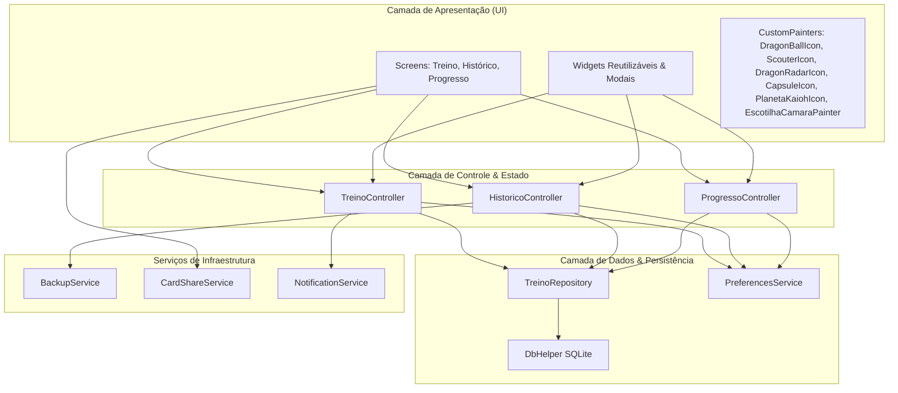
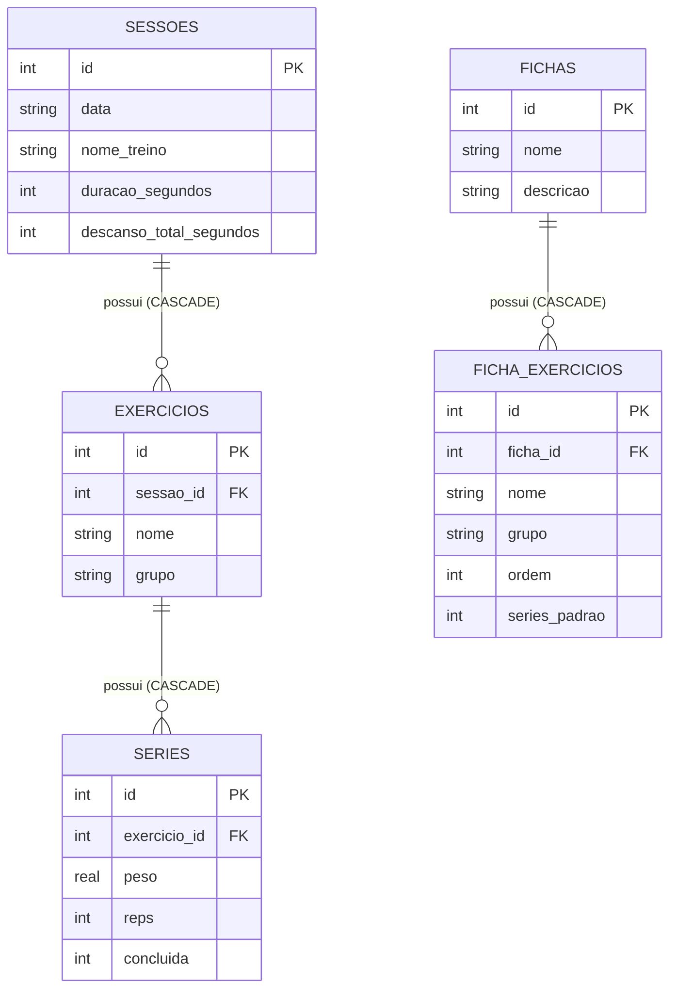

# 🏛️ Arquitetura e Engenharia de Software

O **Gym Saiyajin** é estruturado sobre princípios sólidos de arquitetura limpa e separação de preocupações (*Separation of Concerns*), projetado para operar em modelo **offline-first** com tolerância a falhas, integridade referencial e alta performance em dispositivos móveis Android.

---

## 🏗️ 1. Visão Geral das Camadas

### Detalhamento das Camadas:

- **`lib/screens/`**: Telas de alto nível (`TreinoScreen`, `HistoricoScreen`, `ProgressoScreen`), responsáveis pela montagem do Scaffold, BottomNavigationBar e injeção dos controllers.
- **`lib/widgets/`**: Componentes modulares reutilizáveis e modais operacionais (ex: gerenciamento de fichas, quadro de recordes, compartilhamento de card, cronômetro circular).
- **`lib/controllers/`**: Implementam a lógica de negócio estendendo `ChangeNotifier`. Não guardam dependência de contexto de UI (`BuildContext`), permitindo testes unitários rápidos e puros.
- **`lib/models/`**: Entidades de domínio tipadas com construtores imutáveis, métodos `copyWith` e serialização bidirecional `toJson`/`fromJson`.
- **`lib/repositories/`**: Centralizam o acesso aos dados SQLite através de operações transacionais (`db.transaction`), queries parametrizadas e tratamento de erros.
- **`lib/services/`**: Serviços transversais (notificações nativas, vibração háptica, player sonoro, compartilhamento e exportação de backups).
- **`lib/theme/`**: Design tokens e paleta centralizada em `AppColors`.

---

## 💾 2. Banco de Dados SQLite (Schema & Migrações)

O banco de dados relacional é gerenciado pela classe [`DbHelper`](file:///c:/Users/luand/Documents/Codigos/Dart/gym_saiyajin/lib/database/db_helper.dart), armazenado no arquivo `gym_saiyajin.db`.

### Configurações de Integridade:
- **`PRAGMA foreign_keys = ON;`**: Ativado via callback `onConfigure`, garantindo integridade referencial estrita e exclusões automáticas em cascata (`ON DELETE CASCADE`).

### Histórico de Migrações (`onUpgrade`):
- **Versão 1 $\to$ 2**:
  - Adição das tabelas de templates permanentes `fichas` e `ficha_exercicios`.
- **Versão 2 $\to$ 3**:
  - Adição da coluna `nome_treino TEXT` na tabela `sessoes` para registrar a divisão executada.
  - Adição da coluna `series_padrao INTEGER DEFAULT 3` na tabela `ficha_exercicios` para permitir personalização de séries por exercício.
  - Criação de índices de busca rápida (`idx_sessoes_data`, `idx_exercicios_sessao`, `idx_series_exercicio`, `idx_ficha_exercicios_ficha`).

---

## ⏱️ 3. Resiliência de Ciclo de Vida e Segundo Plano

O monitoramento do tempo de treino e o cronômetro regressivo de descanso entre séries foram desenvolvidos para serem à prova de interrupções de hardware (como tela bloqueada ou alternância de aplicativos):

1. **Sincronização com Timestamp Real**:
   - O tempo não depende exclusivamente de `Timer.periodic`. O cálculo de duração é derivado da diferença entre `DateTime.now()` e o momento do início do treino menos as pausas acumuladas.
2. **Ciclo de Vida do SO (`WidgetsBindingObserver`)**:
   - No método `didChangeAppLifecycleState`, ao retornar para `AppLifecycleState.resumed`, o controller recalcula imediatamente o tempo decorrido, compensando saltos temporais sem perda de precisão.
3. **Cancelamento Atômico de Notificações**:
   - Ao iniciar um novo descanso ou reiniciar o cronômetro, o `NotificationService` cancela notificações anteriores agendadas antes de emitir um novo alerta, prevenindo toques ou vibrações duplicadas.

---

## 🧪 4. Suíte de Testes Automatizados

O repositório possui cobertura ampla de testes unitários e de widgets na pasta `test/`, executáveis via `flutter test`:

| Arquivo de Teste | Área de Cobertura | Casos Chave |
| :--- | :--- | :--- |
| [`test/compartilhar_card_test.dart`](file:///c:/Users/luand/Documents/Codigos/Dart/gym_saiyajin/test/compartilhar_card_test.dart) | Modal de Compartilhamento Social | Proporções (Stories/Feed), Presets (Slim, Scouter HUD, Rodapé), Cores e Ícones. |
| [`test/dragon_ball_icon_test.dart`](file:///c:/Users/luand/Documents/Codigos/Dart/gym_saiyajin/test/dragon_ball_icon_test.dart) | CustomPainter Esfera do Dragão | Dimensões, renderização de 1 a 7 estrelas e método `shouldRepaint`. |
| [`test/poder_luta_test.dart`](file:///c:/Users/luand/Documents/Codigos/Dart/gym_saiyajin/test/poder_luta_test.dart) | Matemática do Ki e Transformações | Fórmula híbrida, pontuação dos 3 pilares, faixas de poder e auras. |
| [`test/pr_test.dart`](file:///c:/Users/luand/Documents/Codigos/Dart/gym_saiyajin/test/pr_test.dart) | Cálculo de 1RM e Recordes | Fórmula de Epley, teto de 15 reps, formatação limpa e serialização. |
| [`test/tempo_treino_test.dart`](file:///c:/Users/luand/Documents/Codigos/Dart/gym_saiyajin/test/tempo_treino_test.dart) | Cronômetro e Background | Pausa/retomada, saltos temporais com tela bloqueada e persistência de descanso. |
| [`test/treino_controller_test.dart`](file:///c:/Users/luand/Documents/Codigos/Dart/gym_saiyajin/test/treino_controller_test.dart) | Fluxo do Treino e Fichas | Carga anterior, substituição de aparelho ocupado, volume e bônus de Ki por PR. |
| [`test/ficha_test.dart`](file:///c:/Users/luand/Documents/Codigos/Dart/gym_saiyajin/test/ficha_test.dart) | CRUD de Fichas e Templates | Criação, edição, enfileiramento e personalização de séries padrão. |
| [`test/backup_test.dart`](file:///c:/Users/luand/Documents/Codigos/Dart/gym_saiyajin/test/backup_test.dart) | Exportação e Importação JSON | Mesclagem de dados, deduplicação e integridade de schema. |
| [`test/imc_test.dart`](file:///c:/Users/luand/Documents/Codigos/Dart/gym_saiyajin/test/imc_test.dart) | Métricas Corporais | Cálculo de IMC nas 6 faixas da OMS e categorização de BF. |
| [`test/dragon_radar_icon_test.dart`](file:///c:/Users/luand/Documents/Codigos/Dart/gym_saiyajin/test/dragon_radar_icon_test.dart) | CustomPainter Radar do Dragão | Variação de 0 a 7 esferas dinâmicas, mira, dial metálico e shouldRepaint. |
| [`test/capsule_icon_test.dart`](file:///c:/Users/luand/Documents/Codigos/Dart/gym_saiyajin/test/capsule_icon_test.dart) | CustomPainter Cápsula Hoi-Poi | Cores personalizadas, dimensões, botão push trigger e shouldRepaint. |
| [`test/caminho_serpente_test.dart`](file:///c:/Users/luand/Documents/Codigos/Dart/gym_saiyajin/test/caminho_serpente_test.dart) | Caminho da Serpente & Planeta Kaioh | Progressão senoidal, PlanetaKaiohIcon, sessões sempre expandidas e modal de ajuste de tempo. |
| [`test/cronometro_widget_test.dart`](file:///c:/Users/luand/Documents/Codigos/Dart/gym_saiyajin/test/cronometro_widget_test.dart) | Escotilha da Câmara de Regeneração | Estados de repouso, regeneração ativa com bolhas animadas, pausa e telemetria. |
| [`test/ki_aura_icon_test.dart`](file:///c:/Users/luand/Documents/Codigos/Dart/gym_saiyajin/test/ki_aura_icon_test.dart) | CustomPainter Chamas de Ki | Dimensões, suporte a cores de transformação, núcleo de energia, glow e sparks. |
| [`test/notification_service_test.dart`](file:///c:/Users/luand/Documents/Codigos/Dart/gym_saiyajin/test/notification_service_test.dart) | Notificações e Hardware | Cancelamento atômico de alarmes e controle de concorrência. |
