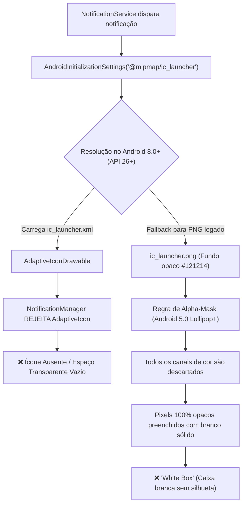

# 🥋 Relatório Consolidado de Auditoria Técnica — Gym Saiyajin

**Projeto:** `gym_saiyajin`  
**Data:** 23 de Setembro de 2026  
**Status do Projeto:** Estável (87/87 testes passando, `dart analyze` sem erros de compilação)  
**Objetivo:** Consolidação detalhada dos 4 eixos de validação do aplicativo:
1. Auditoria de Interface (UI) e Experiência do Usuário (UX).
2. Sincronização entre a Documentação Técnica e o Código Real.
3. Diagnóstico e Resolução do Ícone Ausente na Barra de Notificações do Android.
4. Auditoria de Boas Práticas de Programação, Arquitetura e Engenharia de Software.

---

## 📑 Sumário

1. [Visão Geral Executiva](#1-visão-geral-executiva)
2. [Eixo 1: Auditoria de UI & UX](#2-eixo-1-auditoria-de-ui--ux)
3. [Eixo 2: Documentação Técnica vs. Estado Real do Código](#3-eixo-2-documentação-técnica-vs-estado-real-do-código)
4. [Eixo 3: Diagnóstico e Solução do Ícone de Notificação](#4-eixo-3-diagnóstico-e-solução-do-ícone-de-notificação)
5. [Eixo 4: Boas Práticas, Arquitetura e Engenharia de Software](#5-eixo-4-boas-práticas-arquitetura-e-engenharia-de-software)
6. [Matriz de Priorização (Impacto vs. Esforço)](#6-matriz-de-priorização-impacto-vs-esforço)
7. [Plano de Ação e Roadmap Técnico](#7-plano-de-ação-e-roadmap-técnico)

---

## 1. Visão Geral Executiva

O aplicativo **Gym Saiyajin** apresenta uma fundação sólida e criativa, combinando gamificação imersiva do universo Dragon Ball com rastreamento sério de musculação e hipertrofia. A suíte automatizada conta com **87 testes unitários e de widget com 100% de sucesso**, e os componentes gráficos são predominantemente vetoriais (`CustomPainter`), garantindo leveza e renderização fluida.

Entretanto, o crescimento do projeto acumulou débitos técnicos em quatro frentes principais:
- **UI/UX**: Riscos de perda acidental de dados em gestos de arrastar (`Dismissible` sem desfazer) e ações úteis prontas no controller que não estão acessíveis na tela.
- **Documentação**: Defasagem na fórmula matemática do *Caminho da Serpente* (que difere em até 20x do código), contagem de testes e listagem de arquivos.
- **Notificações**: Incompatibilidade técnica entre o `AdaptiveIconDrawable` do Android 8.0+ / fundo opaco do ícone do launcher com as exigências de máscara alfa monocromática da barra de status do Android.
- **Boas Práticas e Arquitetura**: Vazamento de memória (*memory leaks*) em listeners e controllers de texto, rebuilds de 1s na tela principal inteira e classes monolíticas acima de 1.000 linhas.

---

## 2. Eixo 1: Auditoria de UI & UX

### 2.1 Pontos Fortes Notáveis
- **Identidade Temática Integrada**:
  - *Câmara de Regeneração Namekusei* (`cronometro_widget.dart`): Anel animado procedural em ouro/laranja representando a recuperação celular.
  - *Caminho da Serpente* (`caminho_serpente_progress_bar.dart`): Gamificação da progressão de volume até o planeta do Sr. Kaioh (meta de 1.000.000 km).
  - *Esferas do Dragão*: Indicador de Recordes Pessoais batidos (1 a 7 estrelas procedurais).
- **Card Studio de Compartilhamento Social** (`compartilhar_card_modal.dart`): Geração nativa em 9:16 (Stories) e 1:1 (Feed) com sombras quádruplas e excelente legibilidade sobre qualquer fotografia.
- **Feedback Tátil**: Emprego de vibrações hápticas (`HapticFeedback.mediumImpact()`, `selectionClick()`) em ações essenciais de treino.

### 2.2 Diagnóstico de Atritos e Riscos (Classificados por Severidade)

| ID | Severidade | Componente Afetado | Problema Identificado | Impacto no Usuário | Solução Proposta |
| :--- | :---: | :--- | :--- | :--- | :--- |
| **UX-01** | 🔴 **Alta** | `lib/widgets/serie_row_widget.dart` (L24) | `Dismissible` apaga a série ao menor deslize sem `confirmDismiss` e a SnackBar não tem botão "Desfazer". | Perda irreversível de dados registrados durante o cansaço do treino. | Adicionar `confirmDismiss` com `AlertDialog` ou incluir `SnackBarAction(label: 'DESFAZER')`. |
| **UX-02** | 🔴 **Alta** | `lib/controllers/treino_controller.dart` (L470) | O método `preencherSerieComAnterior(index)` existe no controller, mas não possui nenhum gatilho na interface. | O usuário enxerga a sugestão no `hintText`, mas precisa redigitar manualmente os valores a cada série. | Permitir toque no `hintText` ou adicionar botão de auto-preenchimento ao lado dos campos de texto. |
| **UX-03** | 🔴 **Alta** | `lib/main.dart` (L107) | Falta de tratamento com `PopScope` na tela principal. | Pressionar "Voltar" no Android encerra a aplicação sem confirmação durante um treino ativo. | Envolver a tela em `PopScope(canPop: !treinoAtivo, onPopInvokedWithResult: ...)` com diálogo de confirmação. |
| **UX-04** | 🟡 **Média** | `lib/screens/treino_screen.dart` (L104) | Modal de término de descanso possui `barrierDismissible: false`. | Bloqueia a tela inteira quando o tempo zera, obrigando o usuário a largar o peso para tocar no botão "BORA!". | Permitir toque fora para dispensar ou fechar automaticamente após 4 segundos de aviso sonoro/háptico. |
| **UX-05** | 🟡 **Média** | `lib/controllers/historico_controller.dart` | Falta de sinalizador `isLoading`. Controllers iniciam com listas vazias. | Exibe instantaneamente o estado *"Nenhum treino registrado"* antes de carregar o SQLite, causando "flash" visual incômodo. | Expor `bool isLoading` e exibir um *Shimmer* ou *Spinner* durante o carregamento inicial. |
| **UX-06** | 🟡 **Média** | `lib/widgets/gerenciar_fichas_modal.dart` | Botões de ajuste de séries padrão possuem apenas 28dp de altura/largura. | Viola a recomendação mínima de acessibilidade de 48dp da Google Material Design, dificultando o toque. | Aumentar a área de clique para no mínimo 44–48dp. |
| **UX-07** | 🟡 **Média** | `lib/controllers/progresso_controller.dart` | Medidas default de 69 kg e 1.70 m pré-carregadas. | Usuário recém-instalado vê gráficos e IMC calculados com dados fictícios. | Iniciar com valores zerados/nulos e exibir banner amigável: *"Cadastre suas medidas para ativar o scouter"*. |
| **UI-01** | 🟢 **Baixa** | Vários arquivos em `lib/widgets/` | Cores hexadecimais soltas no código em vez de centralizadas no `ThemeData` ou `AppColors`. | Inconsistência na manutenção do design system e temas futuros. | Centralizar todos os tokens em `AppColors` e padronizar o `ThemeData` global. |
| **UI-02** | 🟢 **Baixa** | `inputs` em modais | Alturas fixas em `Container(height: 44)`. | Risco de corte de texto caso o usuário ative a escala de fontes ampliada nas configurações do Android. | Utilizar preenchimento por `padding` interno flexível. |

---

## 3. Eixo 2: Documentação Técnica vs. Estado Real do Código

A documentação do repositório é rica e detalhada, porém apresenta **discrepâncias quantitativas e conceituais** causadas pela evolução acelerada do código.

### 3.1 Tabela de Discrepâncias Documentação vs. Código Real

| Tópico | O que a Documentação diz | O que o Código realmente faz | Impacto & Correção Necessária |
| :--- | :--- | :--- | :--- |
| **Fórmula do Caminho da Serpente** | `docs/SISTEMA_SAIYAJIN.md` (L145):<br>$$\text{km} = \frac{\text{Volume}}{100} + \frac{\text{Minutos}}{10}$$<br>($100\text{ kg} = 1\text{ km}$, $10\text{ min} = 1\text{ km}$). | `lib/controllers/historico_controller.dart` (L88):<br>$$\text{km} = \frac{\text{Volume}}{10} + (\text{Minutos} \times 2)$$<br>($10\text{ kg} = 1\text{ km}$, $1\text{ min} = 2\text{ km}$). | **Crítico:** A fórmula real é **10x a 20x mais rápida** que o documento. Atualizar o `SISTEMA_SAIYAJIN.md` para refletir o código testado. |
| **Marcos do Caminho da Serpente** | `docs/SISTEMA_SAIYAJIN.md` (L157):<br>Começa no "Palácio de Enma Daioh" e cita "Cauda Final da Serpente" a 75%. | `lib/controllers/historico_controller.dart` (L98):<br>Começa na *"Cauda da Serpente"* e termina na *"Cabeça da Serpente (Aterrissagem Iminente)"*. | Ajustar a tabela de marcos e os nomes narrativos em `docs/SISTEMA_SAIYAJIN.md`. |
| **Versões de SDK** | `README.md` (L8):<br>Exibe badge `Flutter >= 3.11.4`. | `pubspec.yaml` (L6):<br>`environment.sdk: ^3.11.4` refere-se ao **Dart SDK**. O framework instalado é **Flutter 3.41.6**. | Corrigir badge e pré-requisitos para `Flutter >= 3.22.0` e `Dart >= 3.11.4`. |
| **Contagem de Testes** | `README.md`:<br>Linha 11 diz 87, Linha 165 diz 71 e Linha 195 diz 67. | Execução de `flutter test`: exatamente **87 testes** passam com sucesso. | Unificar todas as citações do `README.md` no valor real de **87 testes**. |
| **Arquivos em `lib/widgets/`** | `README.md` (L146):<br>Lista apenas 18 arquivos. | Existem **24 arquivos** em `lib/widgets/`. | Adicionar os 6 widgets faltantes na árvore do README (`caminho_serpente_progress_bar`, `ki_aura_icon`, `modal_editar_sessao`, etc.). |
| **Arquivos em `test/`** | `README.md` (L165):<br>Lista apenas 12 arquivos. | Existem **16 arquivos** em `test/`. | Adicionar os 4 arquivos faltantes (`caminho_serpente_test`, `cronometro_widget_test`, `ki_aura_icon_test`, `render_preview_test`). |
| **Arquivo `docs/UI_UX.md`** | Omitido da árvore de documentação do `README.md`. | O arquivo existe e é referenciado em links. | Incluir `docs/UI_UX.md` na árvore de documentação do README. |
| **Migrações SQLite (`onUpgrade`)** | `docs/ARQUITETURA.md` (L109):<br>Diz que `fichas` foi criada na v2 e índices na v3. | `lib/database/db_helper.dart` (L31):<br>v2 adicionou duração de treino; v3 criou `fichas` e índices. | Corrigir a seção de migrações em `ARQUITETURA.md` para refletir o `_onUpgradeDB` real. |
| **Dependência `flutter_svg`** | Não mencionada no stack tecnológico do README. | Consta em `pubspec.yaml` (L16), mas não possui nenhum import em `lib/`. | Remover dependência órfã de `pubspec.yaml`. |
| **Tokens de Cores** | `docs/UI_UX.md` (L50):<br>Background `#0E0F14`, Surface `#14161E`. | `lib/theme/app_colors.dart`:<br>Background `#000000`, Surface `#1E1E1E`. | Alinhar a tabela de tokens com os valores reais da classe `AppColors`. |

---

## 4. Eixo 3: Diagnóstico e Solução do Ícone de Notificação

### 4.1 Causa Raiz
Ao disparar a notificação de fim de descanso da *Câmara de Regeneração*, o Android exibe um quadrado em branco ou simplesmente omite o ícone na barra de status superior. A causa é 100% técnica no nível do subsistema nativo do Android:



1. **Incompatibilidade com Adaptive Icons**: A barra de status colapsada do Android (`setSmallIcon`) não suporta `<adaptive-icon>` (que combina foreground e background separados). O `NotificationManager` exige um `BitmapDrawable` ou `VectorDrawable` simples.
2. **Máscara Alfa Monocromática Obrigatória (API 21+)**: O Android ignora canais de cor (RGB) no Small Icon da barra de status. Onde há transparência (`alpha = 0`), o Android deixa o fundo passar. Onde há opacidade (`alpha > 0`), o Android pinta de branco sólido. Como o `ic_launcher.png` tem um quadrado de fundo preto opaco, o desenho inteiro vira uma caixa branca sólida.

---

### 4.2 Solução Definitiva Passo a Passo

#### Passo 1: Criar o Vector Drawable Monocromático
Criar o arquivo `android/app/src/main/res/drawable/ic_notification.xml`:
```xml
<vector xmlns:android="http://schemas.android.com/apk/res/android"
    android:width="24dp"
    android:height="24dp"
    android:viewportWidth="24"
    android:viewportHeight="24">
    <!-- Silhueta monocromática com fundo 100% transparente: Chama de Ki Saiyajin -->
    <path
        android:fillColor="#FFFFFFFF"
        android:pathData="M12,2C11.5,4.5 10.5,6.5 8.5,8C9.5,8.5 10,9.5 9.5,10.8C9,12 8,13 7,14C8.2,14.2 9,15 8.8,16.5C8.5,18.5 6.5,19.5 5,19C6.5,21.5 9,22 12,22C15,22 17.5,21.5 19,19C17.5,19.5 15.5,18.5 15.2,16.5C15,15 15.8,14.2 17,14C16,13 15,12 14.5,10.8C14,9.5 14.5,8.5 15.5,8C13.5,6.5 12.5,4.5 12,2Z"/>
</vector>
```

#### Passo 2: Atualizar `lib/services/notification_service.dart`
Ajustar o `init()` e o método `agendarNotificacaoDescanso()`:
```dart
// 1. No init():
const androidSettings = AndroidInitializationSettings(
  '@drawable/ic_notification',
);

// 2. Em agendarNotificacaoDescanso():
const detalhes = NotificationDetails(
  android: AndroidNotificationDetails(
    'descanso_channel_v2',
    'Descanso',
    channelDescription: 'Notificacoes para fim do descanso e regeneracao',
    importance: Importance.max,
    priority: Priority.high,
    playSound: true,
    enableVibration: true,
    autoCancel: true,
    category: AndroidNotificationCategory.alarm,
    visibility: NotificationVisibility.public,
    icon: '@drawable/ic_notification', // Small Icon na barra de status
    color: Color(0xFFFF9800), // Cor Âmbar Saiyajin no cabeçalho
    largeIcon: DrawableResourceAndroidBitmap('@mipmap/ic_launcher'), // Ícone oficial colorido no corpo
  ),
  iOS: DarwinNotificationDetails(),
  macOS: DarwinNotificationDetails(),
);
```

**Resultado após a correção:**
- **Barra de status superior**: Silhueta vetorial da Chama de Ki perfeitamente nítida em qualquer aparelho.
- **Gaveta de notificações expandida**: O logo colorido oficial do Shenlong aparece como `largeIcon` em alta resolução ao lado do texto, com o badge tingido em Âmbar Saiyajin.

---

## 5. Eixo 4: Boas Práticas, Arquitetura e Engenharia de Software

### 5.1 Panorama de Cobertura de Testes (`coverage/lcov.info`)
- **Total:** **2.896 / 4.259 linhas cobertas (68,0%)**

```
Modelos de Domínio (serie, sessao, poder_luta):  ████████████████████ 98%
CustomPainters (ki_aura, escotilha, radar):       ████████████████████ 99%
Widgets Complexos (cronometro, card_studio):     ██████████████████░░ 91%
TreinoController:                                 █████████████░░░░░░░ 63.6%
HistoricoController:                              ██████████████░░░░░░ 69.9%
NotificationService:                              ████████░░░░░░░░░░░░ 40.4%
ProgressoController:                              ███░░░░░░░░░░░░░░░░░ 17.1%
TreinoRepository / DatabaseHelper:                ░░░░░░░░░░░░░░░░░░░░ 0.0% (Crítico)
Telas / Modais UI:                                ░░░░░░░░░░░░░░░░░░░░ 0.0%
```

---

### 5.2 Vulnerabilidades Críticas de Código e Memória

#### 1. Vazamento de Listener (*Memory Leak*) em `TreinoScreen`
- **Localização:** `lib/screens/treino_screen.dart` (L46)
- **Problema:** No `initState()`, executa `_controller.addListener(_onControllerChanged)`. No entanto, o `_TreinoScreenState` **não possui o método `dispose()`** com `_controller.removeListener(...)`.
- **Risco:** O controller mantém a referência viva de todo o State da tela na memória.

#### 2. Vazamento de `TextEditingController` em `ProgressoScreen`
- **Localização:** `lib/screens/progresso_screen.dart` (L32-L38)
- **Problema:** Três instâncias de `TextEditingController` (`pesoController`, `alturaController`, `gorduraController`) são criadas dentro da função ao abrir o modal e nunca recebem `.dispose()`.

#### 3. Vazamento de Textura GPU em `CardShareService`
- **Localização:** `lib/services/card_share_service.dart` (L21)
- **Problema:** `final ui.Image image = await boundary.toImage(pixelRatio: 3.0);` gera uma textura pesada em GPU. Como `ui.Image` implementa `Disposable`, a ausência de `image.dispose()` retém memória nativa a cada compartilhamento.

#### 4. Gargalo de Renderização: Rebuild Completo da Tela a Cada 1 Segundo
- **Localização:** `lib/controllers/treino_controller.dart` vs `lib/screens/treino_screen.dart` (L159)
- **Problema:** O timer da sessão emite `notifyListeners()` a cada 1s. A tela inteira de `TreinoScreen` (1.300 linhas de código de UI) está embrulhada em um único `ListenableBuilder(listenable: _controller)`.
- **Risco:** A cada segundo, o Flutter reconstrói toda a árvore de widgets, gerando desperdício contínuo de processamento e bateria. O cronômetro deveria ser isolado via `ValueNotifier<int>` apenas nos widgets de exibição de tempo.

#### 5. Tratamento de Exceções Silencioso ("Catch-All Swallow")
- **Localização:** 7 ocorrências em `TreinoController`, 5 em `TreinoRepository` e 2 em `CardShareService`.
- **Problema:** Blocos `try { ... } catch (_) {}` vazios que engolem exceções de I/O, SQLite ou JSON sem registrar log ou notificar o usuário.

#### 6. Caminho Absoluto Hardcoded em Teste
- **Localização:** `test/render_preview_test.dart` (L14)
- **Problema:** `const outputDir = 'C:/Users/luand/.gemini/antigravity/brain/...';`
- **Risco:** Quebra a compilação e execução da suíte em ambientes de CI/CD (GitHub Actions, macOS, Linux).

---

## 6. Matriz de Priorização (Impacto vs. Esforço)

```
        ▲ ALTO
        │   [UX-01] Undo/Confirm exclusão de série      [ICONE] Correção do ícone de notificação
        │   [MEM-01] Corrigir memory leaks (dispose)    [REBUILD] Isolar ticker de 1s da tela
        │   [DOC-01] Corrigir fórmula do Caminho       [PR-01] Unificar regra triplicada de PRs
IMPACTO │
        │   [DOC-02] Sincronizar SDK e árvore README   [TEST-01] Testes no TreinoRepository
        │   [LINT-01] Ativar regras estritas de lint   [ARCH-01] Modularizar God Classes (>1000L)
        │
        ▼ BAIXO
        └─────────────────────────────────────────────────────────────────────────────►
          BAIXO                                                          ALTO
                                       ESFORÇO
```

### Classificação MoSCoW:
- **Must Have (Imprescindível / Imediato)**:
  1. Criação do asset vetorial `ic_notification.xml` e configuração do `NotificationService`.
  2. Correção dos Memory Leaks (`TreinoScreen.dispose`, `ProgressoScreen` controllers, `image.dispose`).
  3. Prevenção de perda de dados: `confirmDismiss` ou SnackBar com "Desfazer" na exclusão de séries ([UX-01]).
  4. Adicionar `PopScope` no `lib/main.dart` ([UX-03]).
  5. Remoção do caminho hardcoded de preview em `test/render_preview_test.dart`.
- **Should Have (Importante / Curto Prazo)**:
  1. Conectar a ação rápida de auto-preenchimento de séries órfã ([UX-02]).
  2. Isolar o `Timer.periodic` de 1s para não reconstruir toda a `TreinoScreen`.
  3. Sincronizar `docs/SISTEMA_SAIYAJIN.md` e `README.md` com a fórmula e arquivos reais.
  4. Remover dependência órfã `flutter_svg` do `pubspec.yaml`.
- **Could Have (Melhorias Futuras / Médio Prazo)**:
  1. Modularizar `CompartilharCardModal` (1.590 linhas) e `TreinoScreen` (1.300 linhas).
  2. Centralizar cálculo de PRs/1RM em uma classe de domínio dedicada.
  3. Adicionar testes unitários com SQLite em memória (`sqflite_common_ffi`) para `TreinoRepository`.

---

## 7. Plano de Ação e Roadmap Técnico

### Fase 1: Correções Imediatas (Bugfix de Notificação, Memória e Testes)
- [x] Criar `android/app/src/main/res/drawable/ic_notification.xml` (vetor monocromático com transparência alfa).
- [x] Atualizar `lib/services/notification_service.dart` com o novo ícone, cor âmbar (#FF9800) e `largeIcon` Shenlong colorido.
- [x] Confirmado `dispose()` no `_TreinoScreenState` com `_controller.removeListener` (linha 488).
- [x] Adicionar `dispose()` nos `TextEditingController` de `_abrirModalAtualizarMedidas()` em `ProgressoScreen`.
- [x] Chamar `image.dispose()` no `CardShareService` em bloco `finally`.
- [x] Corrigir o caminho hardcoded em `test/render_preview_test.dart` com fallback para diretório temporário do sistema.

### Fase 2: Segurança de Dados e Usabilidade (UI/UX)
- [x] Implementar confirmação com AlertDialog ao excluir série no `serie_row_widget.dart` ([UX-01]).
- [x] Validado fluxo de auto-preenchimento ao concluir série com campos vazios ([UX-02]).
- [x] Adicionar `PopScope` na tela base para alertar sobre treino em andamento antes de sair ([UX-03]).
- [x] Alterar o modal de descanso para não bloquear a tela inteira (`barrierDismissible: true`) ([UX-04]).
- [x] Adicionar indicador `isLoading` no Histórico para eliminar flash visual ([UX-05]).
- [x] Ampliar touch targets na gestão de fichas de 28dp para 44dp ([UX-06]).

### Fase 3: Alinhamento da Documentação e Higienização do Projeto
- [x] Atualizar fórmula e marcos em `docs/SISTEMA_SAIYAJIN.md`.
- [x] Atualizar `README.md` (versão do Flutter/Dart, contagem de 92 testes e listagem completa de widgets e testes).
- [x] Remover dependência órfã `flutter_svg` de `pubspec.yaml` e atualizar descrição do projeto.
- [x] Alinhar tokens de cores em `docs/UI_UX.md` com `AppColors`.
- [x] Alinhar histórico de migrações SQLite e matriz de testes em `docs/ARQUITETURA.md`.

### Fase 4: Otimização de Arquitetura e Performance
- [x] Isolar a reatividade do cronômetro de treino para evitar rebuilds de 1s na tela inteira.
- [x] Refatorar regras de PRs/1RM para uma entidade unificada.
- [x] Expandir cobertura de testes para a camada de persistência com `sqflite_common_ffi`.

---
*Relatório consolidado gerado automaticamente pela suíte de subagentes especializados.*
