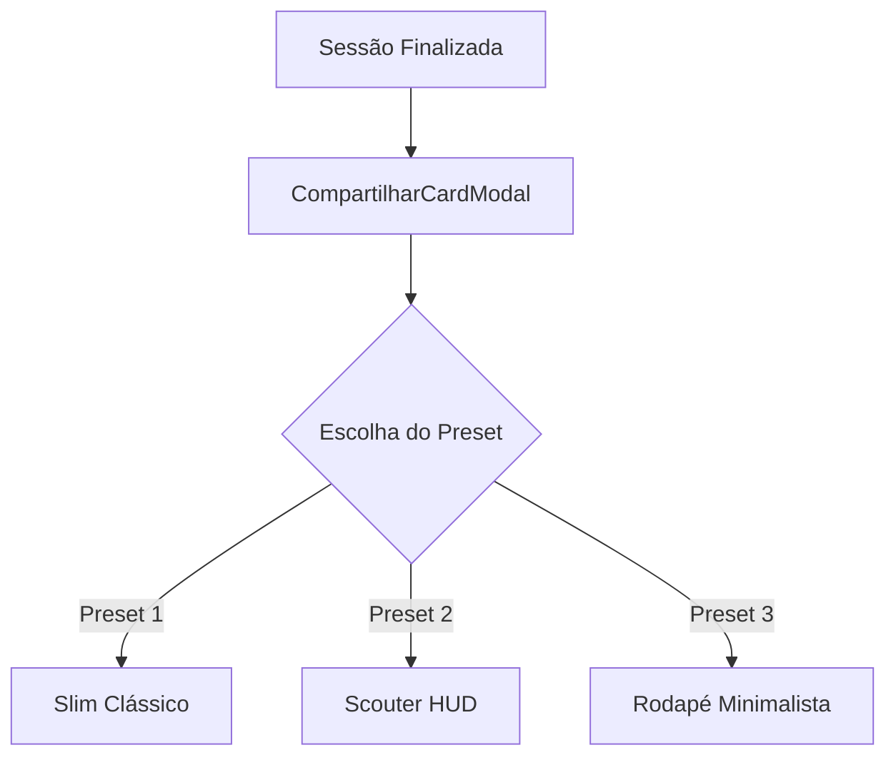
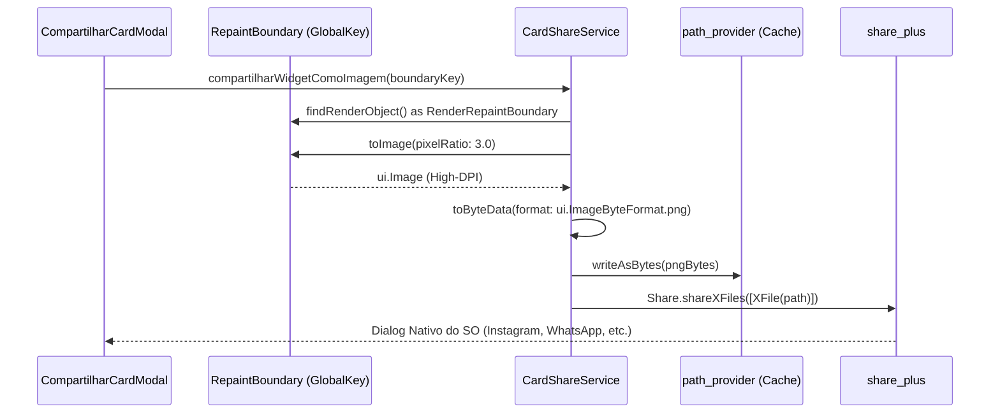

# 📸 Compartilhamento Social Personalizável (Stories & Feed)

O módulo de compartilhamento do **Gym Saiyajin** foi projetado com base no padrão estético e funcional dos melhores aplicativos esportivos do mercado (com destaque para referências de corrida como *Adidas Running* e fotos clássicas de espelho de academia).

O objetivo é proporcionar ao atleta um cartão comemorativo de alto impacto, que valorize o registro visual da sua evolução física sem poluir a imagem ou cobrir o seu corpo com blocos opacos pesados.

---

## 📐 1. Proporções Disponíveis

O modal permite alternar instantaneamente entre dois formatos de exportação:

| Proporção | Formato | Destino Recomendado | Comportamento Visual |
| :--- | :--- | :--- | :--- |
| **`STORIES (9:16)`** | Tela cheia vertical | Instagram Stories, WhatsApp Status, TikTok | Altura estendida, tipografia imponente e paddings verticais generosos para evitar cortes pelas barras nativas do Instagram. |
| **`FEED (1:1)`** | Quadrado perfeito | Feed do Instagram, WhatsApp Chat, Twitter/X | Layout compacto simétrico com fontes e espaçamentos auto-ajustáveis via `FittedBox` e `Flexible`. |

---

## 🎭 2. Presets de Overlay

O atleta dispõe de 3 estilos de composição gráfica que podem ser alternados com um único toque:

### 1. Slim Clássico (Padrão)
- **Inspiração**: Estilo esportivo limpo em espelho de musculação.
- **Estrutura**:
  - **Topo Sutil**: Apenas a pílula sutil da divisão do treino (ex: `TREINO A - PEITO E TRÍCEPS`) centralizada no topo.
  - **Centro e Terço Superior 100% Livres**: Preserva integralmente o rosto, cabeça, fones de ouvido e o físico do atleta em fotos clássicas de espelho.
  - **Base Esportiva**: Três métricas essenciais alinhadas horizontalmente na base (**Duração**, **Volume Total** e **Séries Concluídas**), logo acima do rodapé com o logo de Shenlong, marca e data/@handle.

### 2. Scouter HUD
- **Inspiração**: Telemetria avançada de alto desempenho (estilo Foto 4 do Adidas Running).
- **Estrutura**:
  - **Carimbo Scouter no Topo Direito**: Lente holográfica (`ScouterIcon`), leitura digital de Ki obtido na sessão (`+X Ki`) e Patamar Saiyajin atual.
  - **Badge de Treino no Topo Esquerdo**: Pílula translúcida com borda fosca contendo a divisão do treino.
  - **Dock de Telemetria Unificada na Base**: Painel translúcido de vidro tecnológico de Scouter reunindo as métricas (`Volume`, `Duração`, `Séries`, `DragonBallIcon` com PRs), linha de corte fina e a assinatura oficial com a marca e o `@handle` em uma única moldura coesa com aura de Ki.

### 3. Rodapé Minimalista
- **Inspiração**: Estilo de corrida com terço inferior translúcido (estilo Foto 1 do Adidas Running).
- **Estrutura**:
  - **Topo e Meio 100% Desimpedidos**: O enquadramento superior e central da foto fica totalmente limpo.
  - **Painel Inferior Translúcido Ancorado (*Frosted Glass*)**:
    - Ancorado suavemente na base com gradiente de apoio e margens seguras para Instagram Stories.
    - Cabeçalho interno com a divisão do treino e o badge do patamar de poder.
    - Linha de métricas esportivas separadas por divisores verticais discretos.
    - Divisor translúcido fino com logotipo oficial e `@handle`.

---

## 🎨 3. Controles & Customização

No painel inferior do estúdio em tela cheia (com `SafeArea` e pré-visualização adaptativa via `FittedBox`), o guerreiro tem acesso direto a:

1. **Navegação Entre Presets (Setas & Gesto de Swipe)**:
   - Seletor ergonômico de 48dp com setas esquerda/direita (`<` e `>`), indicador animado de dots de posição (1 de 3) e transição suave.
   - Suporte completo a **gesto de deslize (swipe horizontal)** diretamente sobre a pré-visualização do card ou sobre a barra de controles com feedback háptico.
2. **Seletor de Formato**:
   - Botões ergonômicos ampliados (44dp de altura) para alternar entre **Stories (9:16)** e **Feed (1:1)**.
3. **Ações de Foto Ergonômicas**:
   - Botão **Câmera**: Aciona a câmera nativa do aparelho via `image_picker` (altura 46dp, ícone destacado).
   - Botão **Galeria**: Permite selecionar uma foto existente do rolo da câmera (altura 46dp).
   - Botão **Remover**: Botão de exclusão dedicado de 46x46dp com realce perigo suave, retornando ao fundo texturizado nativo de Shenlong.
4. **Exibição Inteligente de PRs da Sessão Específica**:
   - O card calcula e exibe **estritamente os Recordes Pessoais (PRs) conquistados naquela sessão específica**, e não o total vitalício do app.
   - O `ProgressoController` reconstitui cronologicamente o histórico até o momento do treino compartilhado para determinar se houve quebra de recorde prévio.
   - Quando há PRs, exibe a esfera de 4 estrelas (`DragonBallIcon`) e a formatação precisa no singular ou plural (`1 PR`, `2 PRs`, `3 PRs`...). Caso o treino não tenha tido recordes batidos, a coluna de PR é omitida, mantendo o dock limpo e harmonioso.
5. **Patamar de Transformação Saiyajin Atual**:
   - A categoria estampada no topo direito (Scouter HUD) ou no rodapé exibe o **Patamar atual de evolução do atleta** (ex: *Guerreiro Z, Super Saiyajin...*), carregado de forma unificada tanto pelo término do treino (`TreinoScreen`) quanto pela navegação no histórico (`HistoricoScreen`).
   - A telemetria exibe o ganho instantâneo daquela sessão (`+X Ki`) com a lente do Scouter (`corLenteScouter`) reativa à transformação.
6. **Tipografia de Alto Contraste Nativa**:
   - Texto em branco puro (`Colors.white`) protegido por camadas quádruplas de drop shadow preto (`Shadow`), garantindo contraste absoluto contra qualquer fundo fotográfico (iluminação clara ou escura de academia) sem poluição visual.
7. **Campo de `@handle` / Legenda**:
   - Input dedicado de 46dp com ícone `@`, botão para limpar texto e tecla `Done`. O texto digitado é estampado em tempo real no rodapé do cartão (ex: `@luan.diniz`).
   - Se deixado em branco, o cartão exibe a data formatada como assinatura padrão.
8. **Fallback Texturizado Sem Foto**:
   - Caso o atleta prefira não anexar uma foto de si mesmo, o card renderiza um gradiente escuro texturizado com a silhueta sutil de Shenlong ao fundo, permitindo compartilhar os resultados do treino imediatamente.

---

## ⚙️ 4. Pipeline Técnico de Geração e Exportação

1. **Captura em Alta Resolução (3x DPI)**:
   - A renderização no visor é feita com largura de 300px para pré-visualização ergonômica.
   - Na hora da exportação, o `CardShareService` invoca `toImage(pixelRatio: 3.0)`, gerando uma imagem de **900×1600 px** (Stories) ou **900×900 px** (Feed), garantindo nitidez absoluta nas redes sociais sem pixelização.
2. **Sombras de Texto Multinível**:
   - Todos os textos e badges sobrepostos à foto recebem uma camada quádrupla de `shadows` (`Offset(0, 1)`, `Offset(1, 1)`, `Offset(0, 2)`, etc.) com `Colors.black`, assegurando legibilidade cristalina independentemente de a foto ter pontos de luz estourados ou sombras escuras.
3. **Gerenciamento de Memória**:
   - A geração é assíncrona com indicação de progresso (*spinner*) no botão de ação, prevenindo cliques concorrentes e vazamentos de memória.
