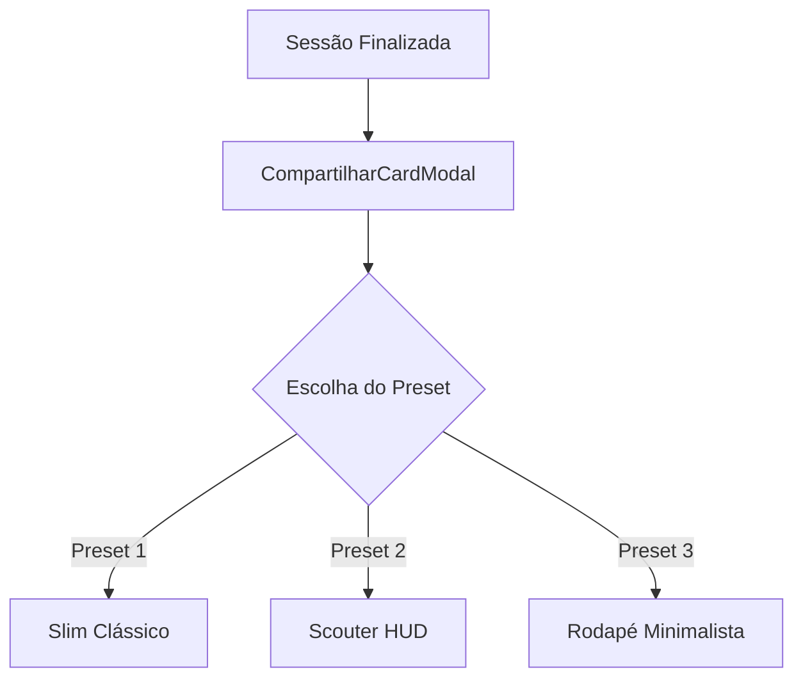
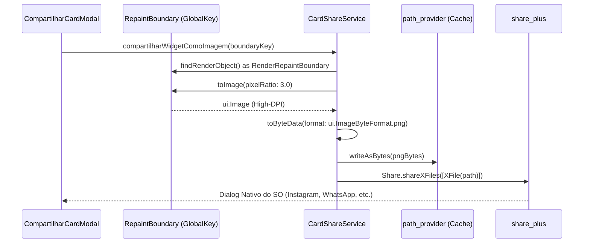

# 📸 Compartilhamento Social Personalizável (Stories & Feed)

O módulo de compartilhamento do **Gym Saiyajin** foi projetado com base no padrão estético e funcional dos melhores aplicativos esportivos do mercado (com destaque para referências de corrida como *Adidas Running* e fotos clássicas de espelho de academia).

O objetivo é proporcionar ao atleta um cartão comemorativo de alto impacto, que valorize o registro visual da sua evolução física sem poluir a imagem ou cobrir o seu corpo com blocos opacos pesados.

---

## 📐 1. Proporções Disponíveis

O modal permite alternar instantaneamente entre dois formatos de exportação:

| Proporção | Formato | Destino Recomendado | Comportamento Visual |
| :--- | :--- | :--- | :--- |
| **`STORIES (9:16)`** | Tela cheia vertical | Instagram Stories, WhatsApp Status, TikTok | Altura estendida, tipografia imponente e paddings verticais generosos para evitar cortes pelas barras nativas do Instagram. |
| **`FEED (1:1)`** | Quadrado perfeito | Feed do Instagram, WhatsApp Chat, Twitter/X | Layout compacto simétrico com fontes e espaçamentos auto-ajustáveis via `FittedBox` e `Flexible`. |

---

## 🎭 2. Presets de Overlay

O atleta dispõe de 3 estilos de composição gráfica que podem ser alternados com um único toque:

### 1. Slim Clássico (Padrão)
- **Inspiração**: Estilo esportivo limpo em espelho de musculação.
- **Estrutura**:
  - **Topo Sutil**: Nome da divisão do treino (ex: `TREINO A - PEITO E TRÍCEPS`) e data/hora com drop shadow natural.
  - **Centro Livre**: 100% da área fotográfica livre de qualquer elemento, destacando a postura e a musculatura do atleta.
  - **Base Esportiva**: Três métricas essenciais alinhadas horizontalmente: **Duração**, **Volume Total** e **Séries Concluídas**.

### 2. Scouter HUD
- **Inspiração**: Telemetria avançada de alto desempenho (estilo Foto 4 do Adidas Running).
- **Estrutura**:
  - **Carimbo Scouter no Topo Direito**: Lente holográfica (`ScouterIcon`), leitura digital de Ki obtido na sessão (`+X Ki`) e Patamar Saiyajin atual.
  - **Badge de Treino no Topo Esquerdo**: Pílula translúcida com borda fosca contendo a divisão do treino.
  - **Base com Detecção de PRs**: Grade atlética com volume, duração, séries e a esfera de 4 estrelas (`DragonBallIcon`) destacando o total de recordes conquistados (`X PRs`).
  - **Assinatura**: Logo de Shenlong acompanhado da marca `GYM SAIYAJIN` e o handle do atleta.

### 3. Rodapé Minimalista
- **Inspiração**: Estilo de corrida com terço inferior translúcido (estilo Foto 1 do Adidas Running).
- **Estrutura**:
  - **Topo e Meio 100% Desimpedidos**: O enquadramento superior da foto fica totalmente limpo.
  - **Painel Inferior Translúcido (*Frosted Glass*)**:
    - Cabeçalho interno com a divisão do treino e o badge do patamar de poder.
    - Linha de métricas esportivas separadas por divisores verticais discretos.
    - Divisor translúcido fino com logotipo oficial e `@handle`.

---

## 🎨 3. Controles & Customização

No painel inferior do modal, o guerreiro tem acesso direto a:

1. **Ações de Foto**:
   - Botão **Câmera**: Aciona a câmera nativa do aparelho via `image_picker`.
   - Botão **Galeria**: Permite selecionar uma foto existente do rolo da câmera.
   - Botão **Remover**: Retorna instantaneamente ao fundo texturizado nativo.
2. **Seletor de Cor da Tipografia**:
   - **Branco**: Máximo contraste e legibilidade em fotos com iluminação de academia ou contraste escuro.
   - **Dourado (`#FFD700` / `#FF9E00`)**: Toque nobre Saiyajin que harmoniza com a paleta do aplicativo.
3. **Campo de `@handle` / Legenda**:
   - Input dedicado com ícone `@`. O texto digitado é estampado em tempo real no rodapé do cartão (ex: `@luan.diniz`).
   - Se deixado em branco, o cartão exibe a data formatada como assinatura.
4. **Fallback Texturizado Sem Foto**:
   - Caso o atleta prefira não anexar uma foto de si mesmo, o card renderiza um gradiente escuro texturizado com a silhueta sutil de Shenlong ao fundo, permitindo compartilhar os resultados do treino imediatamente.

---

## ⚙️ 4. Pipeline Técnico de Geração e Exportação

1. **Captura em Alta Resolução (3x DPI)**:
   - A renderização no visor é feita com largura de 300px para pré-visualização ergonômica.
   - Na hora da exportação, o `CardShareService` invoca `toImage(pixelRatio: 3.0)`, gerando uma imagem de **900×1600 px** (Stories) ou **900×900 px** (Feed), garantindo nitidez absoluta nas redes sociais sem pixelização.
2. **Sombras de Texto Multinível**:
   - Todos os textos e badges sobrepostos à foto recebem uma camada quádrupla de `shadows` (`Offset(0, 1)`, `Offset(1, 1)`, `Offset(0, 2)`, etc.) com `Colors.black`, assegurando legibilidade cristalina independentemente de a foto ter pontos de luz estourados ou sombras escuras.
3. **Gerenciamento de Memória**:
   - A geração é assíncrona com indicação de progresso (*spinner*) no botão de ação, prevenindo cliques concorrentes e vazamentos de memória.
