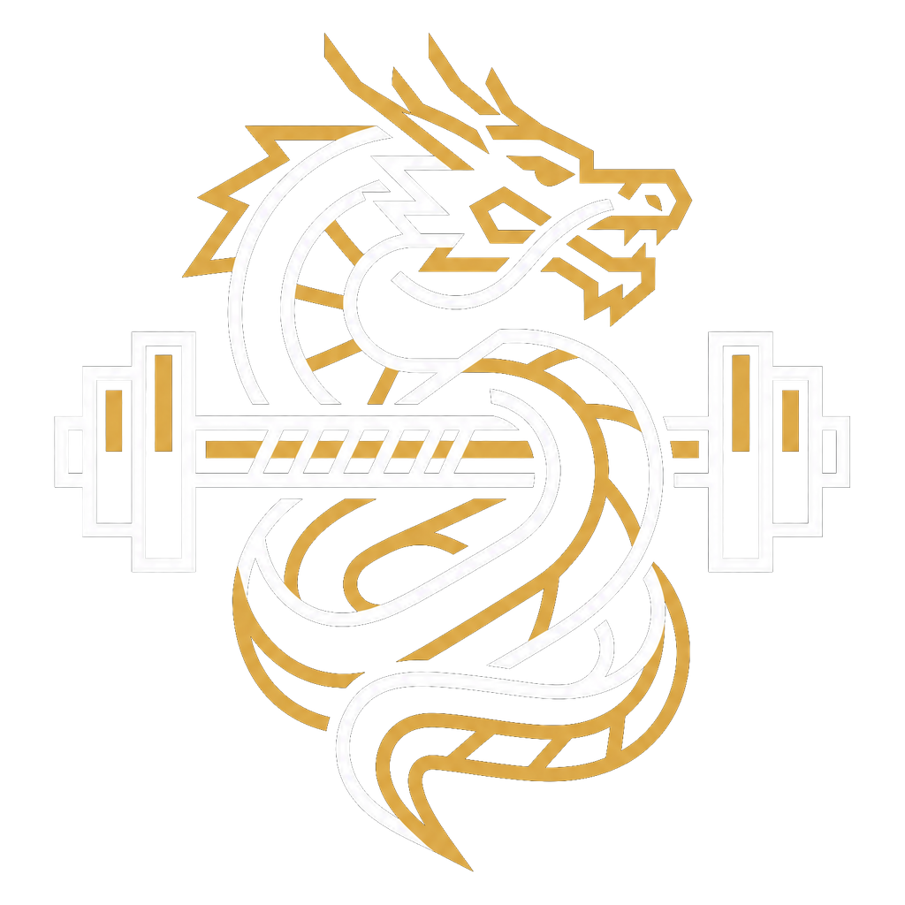
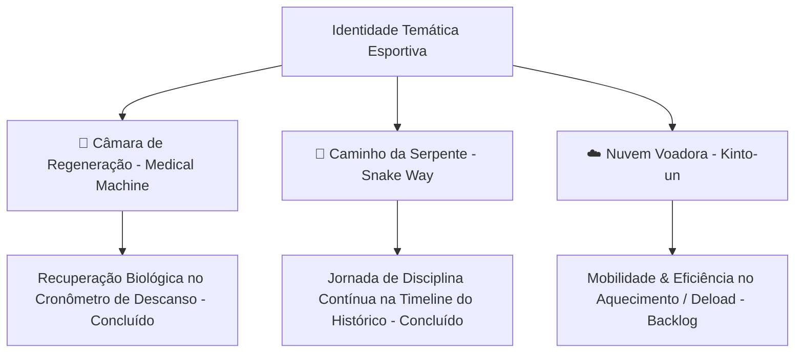

  
   
  <h1 align="center">Propostas Temáticas & Próximos Passos Saiyajin</h1>

Este documento consolida e detalha o planejamento das próximas evoluções temáticas do **Gym Saiyajin**, conectando elementos canônicos do universo Dragon Ball à fisiologia do treino de força e hipertrofia de forma sóbria, elegante e esportiva.

---

## 🧭 Visão Geral das Propostas

---

## 🧪 Proposta 1: A "Câmara de Regeneração Médica" no Cronômetro de Descanso [✅ CONCLUÍDO]

### 1. Justificativa & Lore Canônica
- **Conceito Biológico**: Em Dragon Ball Z, a Câmara de Regeneração Médica (*Medical Machine / Cápsula de Namekusei*) é o ápice da biotecnologia de cura onde Goku se recuperou após as batalhas devastadoras contra as Forças Ginyu.
- **Aplicação no Treino**: No treinamento de musculação, o período de descanso entre séries é a janela de regeneração de ATP-CP, tamponamento de íons de hidrogênio e restauração neuromuscular para a próxima batalha de alta carga.

### 2. Implementação Final Entregue
- **Escotilha Industrial com Rebites (`EscotilhaCamaraPainter`)**:
  - Moldura circular exterior em titânio escuro chanfrado com 8 rebites prateados tridimensionais.
  - Anel de fluido bioenergético em **Ouro Super Saiyajin e Laranja Ki** (`#FFD700` $\to$ `#FF8C00`), harmonizado com a identidade visual do app.
  - Micro-bolhas procedurais animadas subindo continuamente e silhueta discreta da máscara de oxigênio submersa.
  - Chip superior de telemetria médica (`REGENERAÇÃO` / `PAUSADO` / `CÂMARA DE CURA`).
  - Sincronização matemática exata entre tempo restante e descanso acumulado via arredondamento com teto (`ceil`), eliminando qualquer delay de 1s.

---

## 🐍 Proposta 2: Histórico de Treinos como o "Caminho da Serpente" (*Snake Way*) [✅ CONCLUÍDO]

### 1. Justificativa & Lore Canônica
- **Conceito Biológico**: O Caminho da Serpente (*Serpentine Road / Snake Way*) tem 1 milhão de quilômetros e representa a maior prova de disciplina, persistência inabalável e condicionamento que Goku enfrentou para treinar com o Senhor Kaioh.
- **Aplicação no Treino**: A hipertrofia e a força não são construídas em uma única sessão, mas sim na constância de centenas de treinos ao longo dos meses e anos. A timeline do histórico deve transmitir essa sensação de jornada épica e acumulada.

### 2. Implementação Final Entregue
- **Barra Senoidal Suave Sempre Visível (`CaminhoSerpenteProgressBar`)**:
  - Modelagem matemática em função senoidal contínua ($2.5$ ciclos), drop shadow realista e nuvens celestiais do Outro Mundo.
  - Indicador de Ki do guerreiro que se move em tempo real conforme os quilômetros são conquistados.
  - Ponto de chegada ornado com o ícone vetorial cel-shaded em 3D do **Planeta do Sr. Kaioh** (`PlanetaKaiohIcon`).
  - Selo marcial oficial do Senhor Kaioh (**界王**) com tipografia destacada e aro dourado no topo.
- **Card Interativo & Odômetro de Ferro**:
  - Exibição de porcentagem percorrida e chevron animado.
  - Toque no card expande as métricas consolidadas: Odômetro numérico detalhado (`X km / Meta: 1.000.000 km`), marco narrativo de lore e os 3 cards (*Carga Total*, *Tempo Total* e *Sessões*).
- **Harmonização da Linha do Tempo**:
  - Sessões sempre expandidas para consulta imediata de exercícios e séries sem atrito.
  - Nós uniformes com ícone de calendário Saiyajin (`Icons.calendar_month`).
  - Linha única horizontal para Data, Divisão e Badge de PRs, com menu unificado `⋮`.

---

## ☁️ Proposta 3: A "Nuvem Voadora" (*Kinto-un*) na Gestão de Fichas & Mobilidade

### 1. Justificativa & Lore Canônica
- A Nuvem Voadora exige pureza de intenções, leveza e agilidade.
- **Aplicação no Treino**:
  - Indicador de **Mobilidade, Aquecimento e Séries de Aquecimento/Warm-up**.
  - No modal de Fichas e seleção de exercícios, séries marcadas como *Warm-up* (aquecimento neuromuscular) ou treinos de *Deload* (semana regenerativa) recebem a insígnia da Nuvem Voadora, indicando ausência de fadiga pesada e foco em fluidez de movimento.

---

## 🗓️ Tabela Comparativa & Status

| Proposta | Componente Principal | Onde Atua | Complexidade | Status |
| :--- | :--- | :--- | :--- | :--- |
| **🧪 Câmara de Regeneração** | `EscotilhaCamaraPainter` + Cronômetro | `TreinoScreen` (Tela de Treino) | Alta (Painter 3D + animação + sync) | **✅ CONCLUÍDO & TESTADO** |
| **🐍 Caminho da Serpente** | Barra Senoidal + `PlanetaKaiohIcon` + Odômetro | `HistoricoScreen` (Tela de Histórico) | Alta (Painter senoidal + métricas) | **✅ CONCLUÍDO & TESTADO** |
| **⚡ Chamas de Ki** | `KiAuraIcon` + `KiAuraPainter` | `PoderLutaCardWidget` & `Recordes` | Média (Silhueta cel-shaded + glows) | **✅ CONCLUÍDO & TESTADO** |
| **☁️ Nuvem Voadora** | `KintoUnIcon` + Badge de Aquecimento | `Fichas` & `SerieRowWidget` | Baixa/Média | **🚀 Próxima Prioridade** |

---

## 📋 Próximos Passos de Execução Recomendados

1. **Chamas de Ki (`KiAuraIcon`) [✅ CONCLUÍDO]**:
   - Labareda vetorial canônica com cristas pontiagudas voltadas para cima, gradiente dinâmico de energia, núcleo superdenso (*inner core*) e micro-faíscas/sparks.
   - Integração no pilar de Vigor Saiyajin e substituição definitiva de `Icons.bolt_rounded`.
2. **Nuvem Voadora (`KintoUnIcon`) [🚀 Próxima Fase]**:
   - Especificação e design do badge de séries de aquecimento (*warm-up*).
   - Não interferir nos recordes nem nos cálculos de 1RM.

