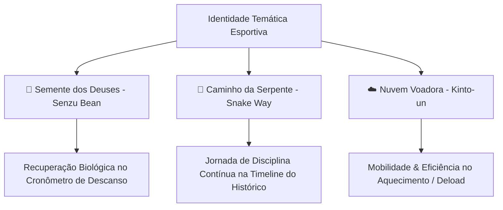

# 📜 Propostas Temáticas & Próximos Passos Saiyajin

Este documento consolida e detalha o planejamento das próximas evoluções temáticas do **Gym Saiyajin**, conectando elementos canônicos do universo Dragon Ball à fisiologia do treino de força e hipertrofia de forma sóbria, elegante e esportiva.

---

## 🧭 Visão Geral das Propostas

---

## 🌱 Proposta 1: A "Semente dos Deuses" (*Senzu Bean*) no Cronômetro de Descanso

### 1. Justificativa & Lore Canônica
- **Conceito Biológico**: Na lore de Dragon Ball, a Semente dos Deuses (*Senzu Bean*) restaura instantaneamente o vigor físico, recupera lesões musculares e restabelece a energia vital (Ki) dos guerreiros após batalhas intensas.
- **Aplicação no Treino**: No treinamento de musculação, o período de descanso entre séries é justamente a janela de recuperação fisiológica de ATP-CP, depuração de metabólitos e restauração do sistema neuromuscular.
- **Tom & Seriedade**: Ao invés de usar emojis infantis, a Semente dos Deuses será representada por um ícone vetorial proprietário de alta precisão geométrica com acabamento premium.

### 2. Especificação Técnica & Visual

#### A. Componente Vetorial: `SenzuBeanIcon`
- **Arquivo Previsto**: `lib/widgets/senzu_bean_icon.dart`
- **Técnica**: `CustomPainter` renderizado em Canvas.
- **Geometria**:
  - Formato reniforme orgânico característico do feijão mágico.
  - Gradiente suave verde esmeralda / musgo nobre (`#4CAF50` $\to$ `#2E7D32`).
  - Brilho especular curvo translúcido superior (`#81C784`), conferindo profundidade tridimensional.
  - Vinco longitudinal central sutil com sombra projetada.

#### B. Integração no `CronometroWidget`
- **Arquivo**: `lib/widgets/cronometro_widget.dart`
- **Comportamento Interativo**:
  - **Fase de Descanso em Andamento**:
    - O ícone `SenzuBeanIcon` repousa elegantemente acima do visor numérico digital central.
    - Uma animação suave de respiração/pulsação (*breathing glow* de 0.8s) em tom esmeralda circunda o anel de progresso, indicando a "regeneração celular e recuperação de ATP".
  - **Fim do Descanso (00:00)**:
    - O feijão emite um sutil pulso de luz (*flare* verde dourado), sinalizando que o guerreiro está 100% regenerado e pronto para a próxima série com carga máxima.
    - O feedback háptico (vibração curta) e o alerta sonoro ocorrem em sincronia com o brilho.

---

## 🐍 Proposta 2: Histórico de Treinos como o "Caminho da Serpente" (*Snake Way*)

### 1. Justificativa & Lore Canônica
- **Conceito Biológico**: O Caminho da Serpente (*Serpentine Road / Snake Way*) tem 1 milhão de quilômetros e representa a maior prova de disciplina, persistência inabalável e condicionamento que Goku enfrentou para treinar com o Senhor Kaioh.
- **Aplicação no Treino**: A hipertrofia e a força não são construídas em uma única sessão, mas sim na constância de centenas de treinos ao longo dos meses e anos. A timeline do histórico deve transmitir essa sensação de jornada épica e acumulada.

### 2. Especificação Técnica & Visual

#### A. Estilização da Timeline no `HistoricoScreen`
- **Arquivo**: `lib/screens/historico_screen.dart` e `lib/widgets/historico_card_widget.dart`
- **Elementos Visuais**:
  - **A Linha-Guia Serpenteante**:
    - A atual linha vertical cinza da timeline passa a ter uma leve ondulação orgânica suave desenhada via `CustomPainter` contínuo.
    - Gradiente dinâmico na linha: tons de pedra ancestral Saiyajin (`#2A2B36`) com realces sutis em âmbar dourado conectando as sessões concluídas.
  - **Nós de Treino (Marcos de Passagem)**:
    - Cada dia de treino concluído atua como um "Marco do Caminho", exibindo um nó hexagonal ou anel metálico.
    - Sessões com **PRs batidos** recebem um anel dourado com micro-esfera de 4 estrelas (`DragonBallIcon`), indicando um grande marco de superação na travessia.

#### B. Odômetro de Ferro ("Quilômetros Percorridos")
- **Cabeçalho Analítico no Topo do Histórico**:
  - Um painel consolidado esportivo converte a tonelagem total acumulada e o tempo total de treino em "Quilômetros no Caminho da Serpente".
  - **Cálculo Proposto**:
    $$\text{Distância no Caminho (km)} = \left(\frac{\text{Volume Total em kg}}{100}\right) + \left(\frac{\text{Minutos de Treino}}{10}\right)$$
  - Um marcador de progresso mostra a distância percorrida rumo ao planeta do Senhor Kaioh (meta de 1.000.000 km simbólicos), gamificando a retenção a longo prazo.

---

## ☁️ Proposta 3 (Bônus): A "Nuvem Voadora" (*Kinto-un*) na Gestão de Fichas & Mobilidade

### 1. Justificativa & Lore Canônica
- A Nuvem Voadora exige pureza de intenções, leveza e agilidade.
- **Aplicação no Treino**:
  - Indicador de **Mobilidade, Aquecimento e Séries de Aquecimento/Warm-up**.
  - No modal de Fichas e seleção de exercícios, séries marcadas como *Warm-up* (aquecimento neuromuscular) ou treinos de *Deload* (semana regenerativa) recebem a insígnia da Nuvem Voadora, indicando ausência de fadiga pesada e foco em fluidez de movimento.

---

## 🗓️ Tabela Comparativa & Priorização

| Proposta | Componente Principal | Onde Atua | Complexidade | Impacto na Experiência |
| :--- | :--- | :--- | :--- | :--- |
| **🌱 Semente dos Deuses** | `SenzuBeanIcon` + Pulso no Cronômetro | `CronometroWidget` (Tela de Treino) | Média (UI/Canvas) | **Imediato e Diário**: Todo atleta descansa entre séries e verá a animação de recuperação a cada 1-3 minutos. |
| **🐍 Caminho da Serpente** | Linha Serpenteante + Odômetro de Km | `HistoricoScreen` (Tela de Histórico) | Média/Alta (Painter contínuo + Métricas) | **Retenção & Longo Prazo**: Conecta o volume acumulado a uma sensação épica de progresso contínuo. |
| **☁️ Nuvem Voadora** | `KintoUnIcon` + Badge de Aquecimento | `Fichas` & `SerieRowWidget` | Baixa/Média | **Ergonomia Específica**: Organização de séries preparatórias sem sujar o cálculo de PRs. |

---

## 📋 Próximos Passos de Execução Recomendados

1. **Fase 1 (Semente dos Deuses)**:
   - Construir o `SenzuBeanIcon` via `CustomPainter` vetorial com testes unitários dedicados em `test/senzu_bean_icon_test.dart`.
   - Integrar no `CronometroWidget` durante a contagem regressiva de descanso.
2. **Fase 2 (Caminho da Serpente)**:
   - Implementar o indicador de "Quilômetros de Ferro" no cabeçalho do `HistoricoScreen`.
   - Estilizar a linha de timeline e os nós de marcos comemorativos de PRs.
