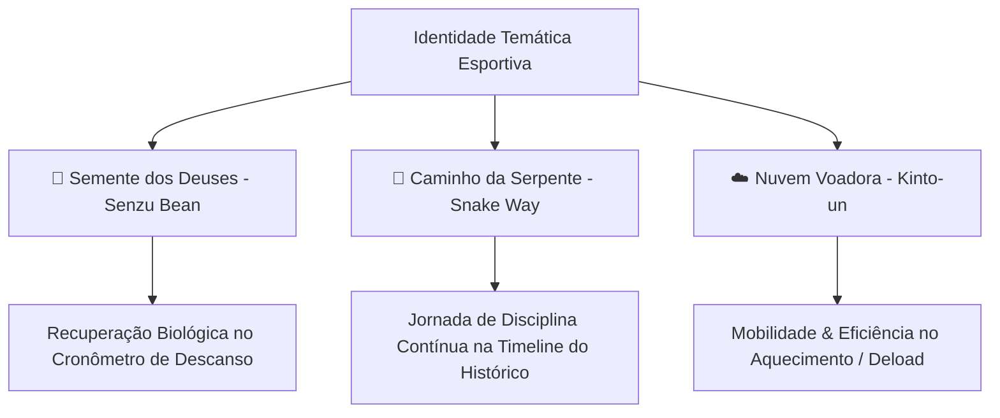

# 📜 Propostas Temáticas & Próximos Passos Saiyajin

Este documento consolida e detalha o planejamento das próximas evoluções temáticas do **Gym Saiyajin**, conectando elementos canônicos do universo Dragon Ball à fisiologia do treino de força e hipertrofia de forma sóbria, elegante e esportiva.

---

## 🧭 Visão Geral das Propostas

---

## 🌱 Proposta 1: A "Semente dos Deuses" (*Senzu Bean*) no Cronômetro de Descanso

### 1. Justificativa & Lore Canônica
- **Conceito Biológico**: Na lore de Dragon Ball, a Semente dos Deuses (*Senzu Bean*) restaura instantaneamente o vigor físico, recupera lesões musculares e restabelece a energia vital (Ki) dos guerreiros após batalhas intensas.
- **Aplicação no Treino**: No treinamento de musculação, o período de descanso entre séries é justamente a janela de recuperação fisiológica de ATP-CP, depuração de metabólitos e restauração do sistema neuromuscular.
- **Tom & Seriedade**: Ao invés de usar emojis infantis, a Semente dos Deuses será representada por um ícone vetorial proprietário de alta precisão geométrica com acabamento premium.

### 2. Especificação Técnica & Visual

#### A. Componente Vetorial: `SenzuBeanIcon`
- **Arquivo Previsto**: `lib/widgets/senzu_bean_icon.dart`
- **Técnica**: `CustomPainter` renderizado em Canvas.
- **Geometria**:
  - Formato reniforme orgânico característico do feijão mágico.
  - Gradiente suave verde esmeralda / musgo nobre (`#4CAF50` $\to$ `#2E7D32`).
  - Brilho especular curvo translúcido superior (`#81C784`), conferindo profundidade tridimensional.
  - Vinco longitudinal central sutil com sombra projetada.

#### B. Integração no `CronometroWidget`
- **Arquivo**: `lib/widgets/cronometro_widget.dart`
- **Comportamento Interativo**:
  - **Fase de Descanso em Andamento**:
    - O ícone `SenzuBeanIcon` repousa elegantemente acima do visor numérico digital central.
    - Uma animação suave de respiração/pulsação (*breathing glow* de 0.8s) em tom esmeralda circunda o anel de progresso, indicando a "regeneração celular e recuperação de ATP".
  - **Fim do Descanso (00:00)**:
    - O feijão emite um sutil pulso de luz (*flare* verde dourado), sinalizando que o guerreiro está 100% regenerado e pronto para a próxima série com carga máxima.
    - O feedback háptico (vibração curta) e o alerta sonoro ocorrem em sincronia com o brilho.

---

## 🐍 Proposta 2: Histórico de Treinos como o "Caminho da Serpente" (*Snake Way*) [✅ CONCLUÍDO]

### 1. Justificativa & Lore Canônica
- **Conceito Biológico**: O Caminho da Serpente (*Serpentine Road / Snake Way*) tem 1 milhão de quilômetros e representa a maior prova de disciplina, persistência inabalável e condicionamento que Goku enfrentou para treinar com o Senhor Kaioh.
- **Aplicação no Treino**: A hipertrofia e a força não são construídas em uma única sessão, mas sim na constância de centenas de treinos ao longo dos meses e anos. A timeline do histórico deve transmitir essa sensação de jornada épica e acumulada.

### 2. Implementação Final Entregue
- **Barra Senoidal Suave Sempre Visível (`CaminhoSerpenteProgressBar`)**:
  - Modelagem matemática em função senoidal contínua ($2.5$ ciclos), drop shadow realista e nuvens celestiais do Outro Mundo.
  - Indicador de Ki do guerreiro que se move em tempo real conforme os quilômetros são conquistados.
  - Ponto de chegada ornado com o ícone vetorial cel-shaded em 3D do **Planeta do Sr. Kaioh** (`PlanetaKaiohIcon`).
  - Selo marcial oficial do Senhor Kaioh (**界王**) com tipografia destacada e aro dourado no topo.
- **Card Interativo & Odômetro de Ferro**:
  - Exibição de porcentagem percorrida e chevron animado.
  - Toque no card expande as métricas consolidadas: Odômetro numérico detalhado (`X km / Meta: 1.000.000 km`), marco narrativo de lore e os 3 cards (*Carga Total*, *Tempo Total* e *Sessões*).
- **Harmonização da Linha do Tempo**:
  - Sessões sempre expandidas para consulta imediata de exercícios e séries sem atrito.
  - Nós uniformes com ícone de calendário Saiyajin (`Icons.calendar_month`).
  - Linha única horizontal para Data, Divisão e Badge de PRs, com menu unificado `⋮`.

---

## ☁️ Proposta 3 (Bônus): A "Nuvem Voadora" (*Kinto-un*) na Gestão de Fichas & Mobilidade

### 1. Justificativa & Lore Canônica
- A Nuvem Voadora exige pureza de intenções, leveza e agilidade.
- **Aplicação no Treino**:
  - Indicador de **Mobilidade, Aquecimento e Séries de Aquecimento/Warm-up**.
  - No modal de Fichas e seleção de exercícios, séries marcadas como *Warm-up* (aquecimento neuromuscular) ou treinos de *Deload* (semana regenerativa) recebem a insígnia da Nuvem Voadora, indicando ausência de fadiga pesada e foco em fluidez de movimento.

---

## 🗓️ Tabela Comparativa & Status

| Proposta | Componente Principal | Onde Atua | Complexidade | Status |
| :--- | :--- | :--- | :--- | :--- |
| **🐍 Caminho da Serpente** | Barra Senoidal + `PlanetaKaiohIcon` + Odômetro | `HistoricoScreen` | Alta (Painter senoidal + métricas) | **✅ CONCLUÍDO & TESTADO** |
| **🌱 Semente dos Deuses** | `SenzuBeanIcon` + Pulso no Cronômetro | `CronometroWidget` (Tela de Treino) | Média (UI/Canvas) | **🚀 Próxima Prioridade** |
| **☁️ Nuvem Voadora** | `KintoUnIcon` + Badge de Aquecimento | `Fichas` & `SerieRowWidget` | Baixa/Média | **Backlog Futuro** |

---

## 📋 Próximos Passos de Execução Recomendados

1. **Fase 1 (Semente dos Deuses)**:
   - Construir o `SenzuBeanIcon` via `CustomPainter` vetorial com testes unitários dedicados em `test/senzu_bean_icon_test.dart`.
   - Integrar no `CronometroWidget` durante a contagem regressiva de descanso com pulso de brilho esmeralda.
2. **Fase 2 (Nuvem Voadora)**:
   - Especificação e design do badge de séries de aquecimento (*warm-up*).

