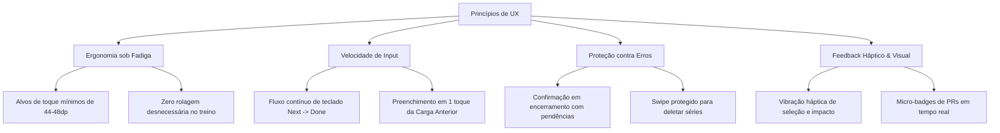
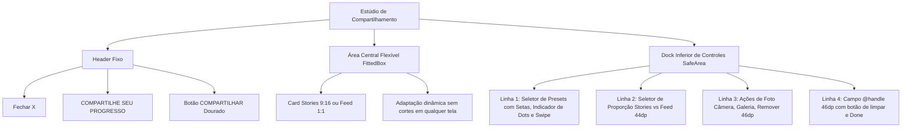

# 🎨 Design System, Ergonomia & Experiência do Usuário (UI/UX)

O **Gym Saiyajin** foi projetado sob uma premissa fundamental de design esportivo mobile: **a interface precisa funcionar com perfeição e clareza no ambiente real da academia**, onde o atleta está ofegante, com as mãos suadas, sob fadiga muscular intensa, luzes adversas e com pouco tempo para interações lentas ou botões diminutos.

A identidade visual combina o rigor e a sobriedade dos principais aplicativos de alto rendimento (*Hevy*, *Nike Training Club*, *Adidas Running*) com a temática épica e motivacional de **Dragon Ball Z**, evitando qualquer tom infantilizado em favor de uma estética dark minimalista, nobre e funcional.

---

## 🏛️ 1. Princípios Fundamentais de UX



### 1. Ergonomia sob Fadiga Física
- **Zonas de Toque Amplas**: Todos os botões primários e seletores respeitam o padrão mínimo de **44×44 dp a 48×48 dp**, garantindo que o dedo acerte o alvo mesmo com tremor muscular pós-série.
- **Leitura Instantânea em Espelho**: Valores numéricos essenciais (carga, repetições, cronômetro de descanso) utilizam tipografia de alto contraste com peso `w800` a `w900`, permitindo que o atleta leia a tela a um braço de distância enquanto descansa no banco.

### 2. Fluxo de Input de Cargas Ultrarrápido
- **Navegação Contínua de Foco**: O campo de **Peso** possui ação de teclado `TextInputAction.next`, pulando o cursor imediatamente para o campo de **Reps**; o campo de Reps possui ação `TextInputAction.done`, que valida e conclui a série imediatamente (*check*), mantendo a fluidez sem exigir toques manuais adicionais.
- **Estabilidade de Foco Blindada**: Os controllers de texto preservam o foco e o estado interno contra rebuilds automáticos provocados por ticks periódicos do cronômetro regressivo.
- **Sugestão de Carga Anterior (Progressive Overload)**: Ao iniciar qualquer exercício, os valores da última sessão concluída são apresentados suavemente como `hintText` e em uma linha discreta de apoio. Caso o atleta toque no botão de check com os inputs vazios, o app preenche automaticamente a série com a carga anterior.

### 3. Feedback Háptico e Sonoro
- **Impacto Tátil (`vibration`)**: Ações determinantes (concluir série, bater recorde, alternar entre modos, disparar o cronômetro) ativam feedbacks hápticos nativos (`HapticFeedback.selectionClick`, `mediumImpact` e `heavyImpact`).
- **Sinalização Sonora de Fim de Descanso**: Alerta nativo de alarme via `flutter_ringtone_player` com cancelamento atômico, garantindo que o atleta saiba exatamente a hora de iniciar a próxima série mesmo com fones de ouvido ou com o celular no chão.

---

## 🎨 2. Design Tokens & Cores (`AppColors`)

A paleta é construída sobre uma base **OLED True Dark**, minimizando o consumo de bateria durante treinos longos e eliminando o ofuscamento visual em ambientes escuros de academia:

```text
┌─────────────────────────────────────────────────────────────┐
│                      PALETA PRINCIPAL                       │
├───────────────────┬─────────────────────────────────────────┤
│ Background        │ #0E0F14 (Preto profundo azulado)        │
│ Surface           │ #14161E (Elevação de cards e painéis)   │
│ Card Border       │ #262938 (Bordas sutis com 1px)          │
│ Primary (Saiyajin)│ #FF8C00 (Laranja Ki tradicional)        │
│ Accent (Ouro SSJ) │ #FFD700 (Dourado Super Saiyajin / PRs)  │
│ Text Light        │ #F5F5F7 (Texto primário de alto leitura)│
│ Text Dimmed       │ #8F94A6 (Rótulos e legendas auxiliares) │
│ Danger            │ #E53935 (Ações destrutivas e avisos)    │
└───────────────────┴─────────────────────────────────────────┘
```

### Paleta dos Patamares de Poder (Transformações)

Cada nível de Ki possui uma identidade cromática exclusiva aplicada em auras, badges, bordas e na lente do Scouter:

| Patamar | Cor Principal | Hex | Lente do Scouter | Significado Semiótico |
| :--- | :--- | :--- | :--- | :--- |
| **Classe Baixa** | Cinza Neutro | `#757575` | `#757575` | O guerreiro no início da sua escalada de força. |
| **Guerreiro Z** | Verde Namekusei | `#4CAF50` | `#4CAF50` | Vitalidade, consistência e disciplina em evolução. |
| **Elite Saiyajin**| Azul Príncipe | `#2196F3` | `#2196F3` | Foco inabalável e intensidade de guerreiro nato. |
| **Super Saiyajin**| Ouro Clássico | `#FFD700` | `#FFD700` | A explosão lendária de força e quebra de barreiras. |
| **Super Saiyajin 2**| Âmbar Elétrico | `#FF9E00` | `#00E5FF` (Ciano) | Borda âmbar com lente ciano em alusão aos raios bioelétricos. |
| **Super Saiyajin 3**| Laranja Vulcânico| `#FF5722` | `#FF5722` | Potência máxima que estremece a estrutura física. |
| **Instinto Superior**| Prata Celestial | `#E0E6ED` | `#80D8FF` | Maestria técnica e estado divino de reflexos puros. |

---

## 📱 3. Anatomia Visual dos Componentes

### 1. Série Row (`SerieRowWidget`)
A linha de execução da série é a unidade mais utilizada do aplicativo, demandando simetria milimétrica:

```text
┌─────────────────────────────────────────────────────────────┐
│  ┌─────┐   PESO (KG)        REPS                            │
│  │PR ⚡│   ┌────────────┐   ┌────────────┐   ┌────────────┐ │
│  │ (1) │   │     80     │   │     10     │   │     ✓      │ │
│  └─────┘   └────────────┘   └────────────┘   └────────────┘ │
│  [Stack]   [Input Núm.]     [Input Núm.]     [Botão Check]  │
└─────────────────────────────────────────────────────────────┘
```

- **Micro-Badge de PR em `Stack(clipBehavior: Clip.none)`**:
  - Posicionado `top: -8` diretamente acima do círculo da série.
  - **Zero impacto na largura horizontal**: não empurra nem espreme os campos de Peso e Reps em celulares estreitos (360dp).
  - **Visual Dark Outline**: Mantém fundo escuro `#14161E` com borda fina dourada e sombra preta. Quando o círculo da série é concluído e ganha preenchimento amarelo brilhante, o micro-badge escuro por cima cria um **contraste de alto relevo nítido e elegante**, sem se fundir na cor de fundo.
  - **Ícone Vetorial Nativo**: Exibe a mini Esfera do Dragão de 1 estrela `DragonBallIcon(size: 10, stars: 1)` na série ativa que quebrou recorde.

### 2. Cronômetro Circular de Descanso (`CronometroWidget`)
- **Visor em Camadas**:
  - Anel externo com `CircularProgressIndicator` de 10px de espessura com cor dinâmica de acordo com o tempo restante.
  - Círculo interno centralizado com fundo escuro translúcido e visor digital em grande escala (`MIN : SEG`).
  - Toque no visor para abertura imediata do modal de ajuste fino de tempo.
- **Modal de Ajuste de Tempo**:
  - Botões satélites `+/- 15s` para correções rápidas sem digitação.
  - Grade simétrica 3×2 de atalhos rápidos (`00:45`, `1:00`, `1:30`, `2:00`, `3:00`, `4:00`).

### 3. Linha do Tempo & Cabeçalho de Sessão (`HistoricoScreen`)
- **Alinhamento em Linha Única Fluida**:
  - Reúne em um único `Wrap` horizontal: **Data do Treino** (`21/09/2026`), **Tag de Divisão/Nome** (`[ COSTAS E BÍCEPS ]`) com fundo escuro e borda âmbar, e o **Badge Dourado de PRs** (`[ ✪ 2 PRs ]`) estilizado com a Esfera do Dragão.
  - Alinhamento à direita exclusivo para o **Menu Popup Unificado (`⋮`)**, eliminando múltiplos botões avulsos na tela e reduzindo drasticamente a sobrecarga cognitiva.
- **Sessões Sempre Expandidas**:
  - Elimina a fadiga de toques múltiplos e acordes fechados: ao navegar pela timeline, todas as sessões já apresentam sua lista completa de exercícios e séries abertas, permitindo inspeção instantânea ao deslizar a tela.
- **Nó Uniforme de Calendário**:
  - Nó circular com `Icons.calendar_month` em laranja Saiyajin com sombra e borda suave em todos os marcos da timeline.
- **Métricas de Sessão em Caixa Alta**:
  - Tipografia de impacto esportivo e espaçamento balanceado:
    `6 EXERCÍCIOS • 23 SÉRIES • VOLUME: 8224 kg • 1 min • 1 min`

### 4. Modal de Edição de Sessões Salvas
- **Campos Editáveis**:
  - Data da sessão (com seletor nativo `DatePicker`).
  - Nome / Divisão do treino com campo de texto e sugestões rápidas.
  - Duração total do treino e tempo acumulado de descanso.
- **Steppers Ergonômicos (+/- 5 min)**:
  - Botões dedicados `[-] 5 min` e `[+] 5 min` com alvos de toque generosos (mínimo de 44dp), alinhados à mesma convenção do cronômetro da tela de treino.
- **Salvaguarda Fisiológica**:
  - O sistema impede matematicamente que o tempo de descanso ultrapasse a duração total do treino (`descanso <= duracao`), prevenindo inconsistências em relatórios analíticos e nos cálculos do Caminho da Serpente.

---

## 📸 4. Estúdio de Compartilhamento Social (UX Imersiva)

O gerador de cartões sociais foi construído com arquitetura de estúdio em tela cheia (`Dialog.fullscreen`), eliminando qualquer sensação de caixa flutuante espremida:



### As 3 Soluções de Presets Gráficos:

#### 1. Slim Clássico (Espelho de Musculação)
- **Desobstrução Total do Físico**: Apenas o badge da divisão fica centralizado no topo. As métricas esportivas (`Duração`, `Volume`, `Séries`) ficam na base, logo acima da marca `GYM SAIYAJIN` e da data/@handle.
- **PRs Contextuais Sem Ruído Visual**: Quando há recordes pessoais batidos na sessão, uma 4ª métrica `PR` / `PRs` (singular ou plural) aparece na base, usando exatamente o mesmo componente tipográfico das outras métricas — sem ícones, sem elementos decorativos extras. Filosofia: a informação existe, mas não compete com a foto.
- **Benefício de UX**: Deixa **100% da área da cabeça, rosto e peitoral desimpedidos**, valorizando a foto real tirada no espelho.

#### 2. Scouter HUD (Telemetria Saiyajin Stealth)
- **Topo**: Divisão do treino no canto esquerdo e Carimbo Scouter holográfico no canto direito (`+X Ki` com lente vetorial `ScouterIcon` reativa à transformação e patamar).
- **Moldura Neutra & Foco na Foto**: Tanto o carimbo quanto o dock inferior utilizam bordas neutras ultrafinas (`Colors.white18`) e vidro fumê translúcido, eliminando contornos neon invasivos para que a foto do físico seja o centro das atenções.
- **Dock de Telemetria Unificada na Base**: Um único container translúcido unindo métricas, contagem contextual de PRs obtidos na sessão (`DragonBallIcon` com `1 PR` / `2 PRs`), divisor fino e a marca com data/@handle.

#### 3. Rodapé Minimalista (Ancorado)
- **Topo e Centro 100% Limpos**: Toda a informação é consolidada em um dock translúcido ancorado na base com cantos arredondados, margens seguras para Instagram Stories e tipografia em branco puro com sombra (evitando blocos de cor saturada concorrentes).
- **Suporte a PRs e Badge Neutro**: Exibe a divisão do treino em branco puro, o patamar em chip fosco discreto e a contagem contextual de PRs.

#### Tipografia de Alto Contraste Nativa
- Padronizada em **branco puro (`Colors.white`)** com sombra multinível preta quádrupla (`Shadow`), garantindo leitura cristalina em qualquer foto (seja com iluminação clara ou sombra profunda).

---

## 🔮 5. Componentes Vetoriais Proprietários (CustomPainter)

Substituímos o uso de emojis convencionais por arte vetorial matemática renderizada via código direto no Canvas:

### `DragonBallIcon`
- **Renderização**:
  - Esfera com gradiente radial esférico âmbar/laranja profundo (`#FFB703` $\to$ `#FB8500`).
  - Brilho especular translúcido simulando reflexo de cristal/acrílico.
  - Estrelas vermelhas de 5 pontas desenhadas matematicamente com funções trigonométricas ($\cos/\sin$ a cada $72^\circ$).
  - Suporte procedural de **1 a 7 estrelas**, distribuídas dinamicamente em anel e centro.
- **Papel na Interface**: Marcador de prestígio de Recordes Pessoais (PRs) no card social e no Quadro de Recordes.

### `ScouterIcon`
- **Renderização**:
  - Haste auricular ergonômica com pinos e juntas mecânicas.
  - Lente translúcida frontal chanfrada em acrílico com cores reativas à transformação ativa.
  - Retículo de mira/alvo interno digital e linhas de telemetria estilizadas.
- **Papel na Interface**: Identificador de telemetria no modo Scouter HUD e ícone de Ki na finalização do treino.

### `DragonRadarIcon`
- **Renderização**:
  - Gabinete metálico circular com bisel prateado chanfrado e botão de cronômetro superior (dial).
  - Visor CRT/LCD verde esmeralda com grade ortogonal de coordenadas e arco especular de vidro curvo.
  - Cursor central com triângulo rubi direcionador e retículo em cruz amarelo.
  - Esferas do Dragão luminosas dinâmicas rastreadas na tela (`dots`, de 0 a 7) com brilho âmbar radial.
- **Papel na Interface**: Gamificação da frequência semanal no card de Meta Semanal (cada dia treinado na semana acende uma esfera no radar).

### `CapsuleIcon`
- **Renderização**:
  - Cápsula Hoi-Poi cilíndrica com calotas hemisféricas peroladas em branco/prata com reflexo curvo de vidro.
  - Botão metálico de acionamento no topo (*push trigger* com haste cilíndrica e anel de retenção).
  - Faixas coloridas vibrantes (com suporte a azul clássico Capsule Corp, laranja Saiyajin, verde e vermelho).
  - Faixa central preta técnica com o logotipo circular canônico da Capsule Corp (monograma em "C" concêntrico).
  - Orientação isométrica dinâmica (~35°) e iluminação 3D longitudinal com sombra projetada.
- **Papel na Interface**: Representação oficial do card de Composição Corporal e Medidas (IMC e Percentual de Gordura) no Dashboard de Progresso.

### `PlanetaKaiohIcon`
- **Renderização**:
  - Mini-planeta esférico cel-shaded com gradiente radial verde grama com iluminação volumétrica 3D (`#7CB342` $\to$ `#33691E`).
  - Estrada anelar circular branca com perspectiva curvada em torno do equador do planeta.
  - O lendário carro conversível vintage esportivo vermelho do Sr. Kaioh estacionado sobre a pista.
  - Casa principal esférica em domo bege com telhado marrom tradicional e anexo/garagem lateral.
  - Copas densas de árvores arredondadas distribuídas na borda e atmosfera sutil translúcida.
- **Papel na Interface**: Destino épico no final do Caminho da Serpente em `CaminhoSerpenteProgressBar`.

### `CaminhoSerpenteProgressBar`
- **Renderização**:
  - Curva senoidal matemática contínua e suave ($y = \text{midY} - A \cdot \sin(t \cdot 2.5 \cdot 2\pi)$) simulando a serpente que serpenteia pelo Outro Mundo.
  - Fundo com nuvens celestiais douradas e drop shadow conferindo profundidade espacial.
  - Ponto de Ki dinâmico do guerreiro com aura brilhante proporcional à porcentagem percorrida rumo a 1.000.000 km.
  - Ponto de chegada ornamentado diretamente com o `PlanetaKaiohPainter`.
  - Selo marcial oficial do Senhor Kaioh (**界王**) em tipografia destacada com aro dourado no topo do card.
- **Papel na Interface**: Barra de progresso sempre visível no card do Caminho da Serpente na tela de Histórico, com suporte a expansão por toque para exibir métricas detalhadas.

---

## 🛡️ 6. Diretrizes de Proteção de Layout & Acessibilidade

1. **Proteção Contra Barras do Sistema (`SafeArea` & `viewInsets`)**:
   - Todo modal e tela implementa margens dinâmicas de `SafeArea`, garantindo que a barra de navegação de 3 botões ou a linha gestual do Android nunca sobreponha botões ou inputs de texto.
2. **Prevenção de Truncamento de Nomes**:
   - Todos os títulos longos de exercícios e rotinas utilizam `Expanded` e `Flexible` com `TextOverflow.ellipsis` ou modo expandido com quebra de linha permitida.
3. **Ocultação Condicional de Badges Zerados**:
   - No modal de encerramento do treino, métricas contextuais como PRs só são renderizadas quando presentes (`totalPrs > 0`). Caso contrário, o elemento é ocultado e a métrica de Volume preenche 100% da largura, preservando a harmonia sem exibir "0 PRs (+0 Ki)".
4. **Internacionalização Numérica dos Pesos**:
   - Cargas inteiras são exibidas sem decimais (`100 kg`), e cargas fracionárias exibem apenas uma casa decimal limpa (`12.5 kg`).
   - Volumes e pontuações de Ki acima de 1.000 são pontuados automaticamente (`27.080 kg`, `+15.200 Ki`).
